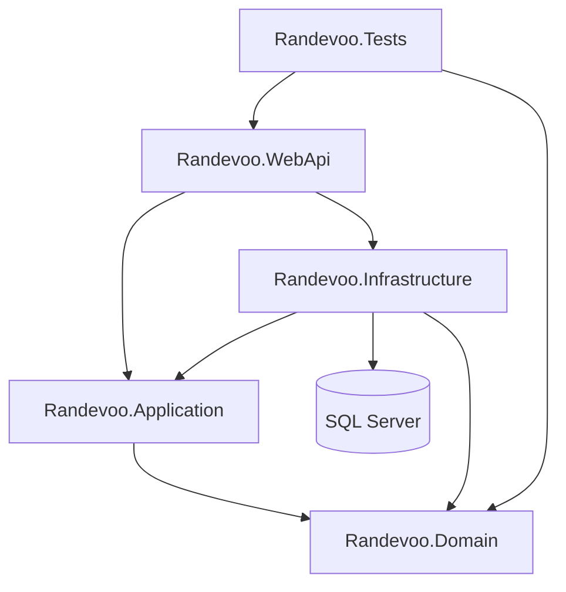

# Randevoo

Randevoo is an event-first dating platform backend built with .NET. The current implementation focuses on real-world dating events, passwordless mobile authentication, role-based access, event ticketing, participant chat, surveys, moderation, balances, and administrative controls.

## Current Product Scope

The implemented system supports:

- Passwordless mobile login with SMS code
- JWT authentication with rotating refresh tokens
- SMS request throttling and failed-code lockout
- Email confirmation flow
- Authenticated profile APIs with owner/admin access checks
- EndUser dating profiles
- EventPlanner profiles and quality metrics
- Admin, EventPlanner, and EndUser roles
- Dating event creation and management
- Ticket purchase with balance deduction
- EventPlanner income and refund transactions
- Event archive for ticketed users
- Participant profile visibility after event start time
- Event-scoped chat with per-event chat limits
- Chat blocking
- Post-event 5-factor surveys for planner quality calculation
- Emergency participant removal with refund
- Moderation reports and admin review
- Event type lookup data and admin event-type management
- Dating events reference event types by foreign key
- Chat-only SignalR hub for live conversation updates
- Privacy export and account deletion workflows
- Scalar/OpenAPI documentation in development

## Architecture

The solution follows a layered Clean Architecture / CQRS style:

- `Randevoo.Domain`: entities, value objects, enums, domain events, repository contracts, domain exceptions
- `Randevoo.Application`: MediatR commands and queries, DTOs, workflow orchestration, interfaces
- `Randevoo.Infrastructure`: EF Core, SQL Server, repositories, unit of work, JWT service, console SMS/email senders
- `Randevoo.WebApi`: ASP.NET Core minimal APIs, JWT authentication, authorization policies, Scalar/OpenAPI
- `Randevoo.Tests.Unit`: domain unit tests
- `Randevoo.Tests.Integration`: API integration tests with `WebApplicationFactory`



## Documentation

The documentation portal is here:

[docs/README.md](docs/README.md)

Important docs:

- [System overview](docs/system-overview.md)
- [Domain entities](docs/03-domain/entities.md)
- [Use case map](docs/04-use-cases/use-case-map.md)
- [API contracts](docs/06-architecture/api-contracts.md)
- [Database design](docs/06-architecture/database-design.md)
- [Architecture overview](docs/06-architecture/architecture-overview.md)
- [Test strategy](docs/08-testing/test-strategy.md)
- [Traceability matrix](docs/traceability-matrix.md)
- [Coverage report](docs/coverage-report.md)

## Technology Stack

- .NET 10
- ASP.NET Core Minimal APIs
- MediatR
- Entity Framework Core
- SQL Server
- JWT Bearer authentication
- Scalar.AspNetCore
- Serilog
- xUnit
- FluentAssertions
- WebApplicationFactory

## Authentication Model

Randevoo is **not an anonymous dating app**. Users authenticate with their mobile number before using protected features. There is no password to store or remember: each login starts with a new SMS code.

Current auth behavior:

- Mobile login code: 6 digits, hashed in the database, valid for 5 minutes
- SMS request limit: 3 login-code requests per 15-minute window per user
- Failed code lockout: 5 wrong attempts locks mobile login for 15 minutes
- Access token: JWT bearer token, valid for 15 minutes by default
- Refresh token: opaque random token, hashed in the database, valid for 30 days by default
- Refresh rotation: every refresh revokes the old refresh token and returns a new one
- Logout: revokes the submitted refresh token
- Email confirmation: token is hashed and valid for 24 hours

Versioned API URLs are available under `/api/v1/...`. Existing `/api/...` routes remain available as compatibility aliases during development.

## Getting Started

Restore and build:

```powershell
dotnet restore Randevoo.sln
dotnet build Randevoo.sln
```

Apply migrations:

```powershell
dotnet ef database update --project src/Randevoo.Infrastructure/Randevoo.Infrastructure.csproj --startup-project src/Randevoo.WebApi/Randevoo.WebApi.csproj --context RandevooDbContext
```

Run tests:

```powershell
dotnet test Randevoo.sln
```

Run the API:

```powershell
dotnet run --project src/Randevoo.WebApi/Randevoo.WebApi.csproj --urls http://localhost:5031
```

Open Scalar:

```text
http://localhost:5031/scalar/v1
```

## Default Development Configuration

Development settings live in `src/Randevoo.WebApi/appsettings.Development.json`:

- SQL Server connection: `ConnectionStrings:DefaultConnection`
- JWT issuer: `Randevoo`
- JWT audience: `Randevoo`
- JWT secret: development/testing fallback in code; production must provide `Jwt:Secret`
- JWT lifetime: `Jwt:ExpiresMinutes`, currently `15`
- Refresh token lifetime: `Auth:RefreshTokenExpiresDays`, currently `30`

Outside Development/Testing, the API fails fast if `ConnectionStrings:DefaultConnection` or `Jwt:Secret` is missing. For production, provide those values through environment configuration or secret manager and replace console notification senders.

## Logging

This project uses Serilog for structured logs and an `AuditLogs` table for sensitive business actions.

Development logging:

- Console logs
- Rolling file logs under `src/Randevoo.WebApi/logs`
- Optional Seq at `http://localhost:5341`

Run Seq locally:

```powershell
docker run --name seq -d --restart unless-stopped -e ACCEPT_EULA=Y -p 5341:80 datalust/seq
```

Sensitive values are intentionally excluded from logs: OTP codes, JWTs, refresh tokens, email confirmation links, authorization headers, cookies, secrets, connection strings, and full request/response bodies.

See [docs/observability/logging-strategy.md](docs/observability/logging-strategy.md).

## Implemented Roles

| Role | Current Capabilities |
|---|---|
| EndUser | profile, event browsing, ticket purchase, archive, participant profiles after event start, chat, block, survey, reports, own balance |
| EventPlanner | planner profile, event creation/management, participant list, participant SMS, emergency participant removal, own balance |
| Admin | role management, balance adjustment/lookup, commission changes, event type management, moderation review, broad event/participant management |

## Current Test Coverage

Current test suite:

- 21 unit tests
- 20 integration tests

Covered areas include auth, refresh-token rotation, logout revocation, SMS request throttling, login lockout, email confirmation, dating profile authorization ownership, event planner profile, event management, ticket purchase, balance adjustment, participant visibility, chat, blocking, survey, planner quality metrics, event types, moderation reports, emergency removal, and admin role changes.

SQL Server/Testcontainers relational coverage is included in `SqlServerRelationalTests`. It runs only when `RUN_SQLSERVER_TESTCONTAINERS=true` is set so normal local test runs do not require Docker.

## Known Gaps

See [docs/coverage-report.md](docs/coverage-report.md) for the full coverage report.

Notable current gaps:

- Domain events are dispatched through a MediatR notification bridge; no concrete handlers are registered yet.
- SMS/email senders are console-only.
- SignalR currently exists only for event chat.
- No background jobs, scheduled tasks, external API integrations, or E2E tests were found.
