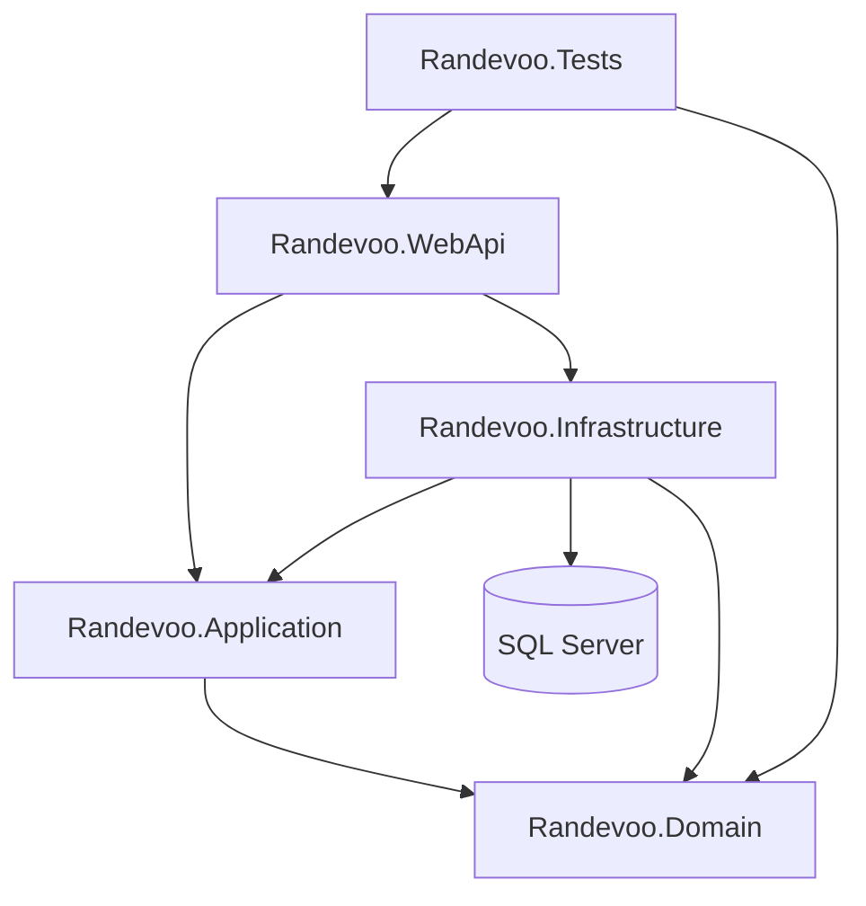

# Randevoo

Randevoo is an event-first dating platform backend built with .NET. The current implementation focuses on real-world dating events, passwordless mobile authentication, role-based access, event ticketing, participant chat, surveys, moderation, balances, and administrative controls.

## Current Product Scope

The implemented system supports:

- Passwordless mobile login with SMS code
- JWT authentication
- Email confirmation flow
- EndUser dating profiles
- EventPlanner profiles and quality metrics
- Admin, EventPlanner, and EndUser roles
- Dating event creation and management
- Ticket purchase with balance deduction
- EventPlanner income and refund transactions
- Event archive for ticketed users
- Participant profile visibility after event start time
- Event-scoped chat with per-event chat limits
- Chat blocking
- Post-event 5-factor surveys for planner quality calculation
- Emergency participant removal with refund
- Moderation reports and admin review
- Event type lookup data and admin event-type management
- Scalar/OpenAPI documentation in development

## Architecture

The solution follows a layered Clean Architecture / CQRS style:

- `Randevoo.Domain`: entities, value objects, enums, domain events, repository contracts, domain exceptions
- `Randevoo.Application`: MediatR commands and queries, DTOs, workflow orchestration, interfaces
- `Randevoo.Infrastructure`: EF Core, SQL Server, repositories, unit of work, JWT service, console SMS/email senders
- `Randevoo.WebApi`: ASP.NET Core minimal APIs, JWT authentication, authorization policies, Scalar/OpenAPI
- `Randevoo.Tests.Unit`: domain unit tests
- `Randevoo.Tests.Integration`: API integration tests with `WebApplicationFactory`



## Documentation

The documentation portal is here:

[docs/README.md](docs/README.md)

Important docs:

- [System overview](docs/system-overview.md)
- [Domain entities](docs/03-domain/entities.md)
- [Use case map](docs/04-use-cases/use-case-map.md)
- [API contracts](docs/06-architecture/api-contracts.md)
- [Database design](docs/06-architecture/database-design.md)
- [Architecture overview](docs/06-architecture/architecture-overview.md)
- [Test strategy](docs/08-testing/test-strategy.md)
- [Traceability matrix](docs/traceability-matrix.md)
- [Coverage report](docs/coverage-report.md)

## Technology Stack

- .NET 10
- ASP.NET Core Minimal APIs
- MediatR
- Entity Framework Core
- SQL Server
- JWT Bearer authentication
- Scalar.AspNetCore
- xUnit
- FluentAssertions
- WebApplicationFactory

## Getting Started

Restore and build:

```powershell
dotnet restore Randevoo.sln
dotnet build Randevoo.sln
```

Apply migrations:

```powershell
dotnet ef database update --project src/Randevoo.Infrastructure/Randevoo.Infrastructure.csproj --startup-project src/Randevoo.WebApi/Randevoo.WebApi.csproj --context RandevooDbContext
```

Run tests:

```powershell
dotnet test Randevoo.sln
```

Run the API:

```powershell
dotnet run --project src/Randevoo.WebApi/Randevoo.WebApi.csproj --urls http://localhost:5031
```

Open Scalar:

```text
http://localhost:5031/scalar/v1
```

## Default Development Configuration

The WebApi uses these fallback settings when configuration values are missing:

- SQL Server connection: `Server=DESKTOP-5QNHMHJ\SQL2019;Database=Randevoo;Trusted_Connection=True;TrustServerCertificate=True;`
- JWT issuer: `Randevoo`
- JWT audience: `Randevoo`
- JWT secret: development fallback value in `Program.cs`

For production, replace the fallback connection string, JWT secret, and console notification senders.

## Implemented Roles

| Role | Current Capabilities |
|---|---|
| EndUser | profile, event browsing, ticket purchase, archive, participant profiles after event start, chat, block, survey, reports, own balance |
| EventPlanner | planner profile, event creation/management, participant list, participant SMS, emergency participant removal, own balance |
| Admin | role management, balance adjustment/lookup, commission changes, event type management, moderation review, broad event/participant management |

## Current Test Coverage

Current test suite:

- 19 unit tests
- 10 integration tests

Covered areas include auth, email confirmation, dating profiles, event planner profile, event management, ticket purchase, balance adjustment, participant visibility, chat, blocking, survey, planner quality metrics, event types, moderation reports, emergency removal, and admin role changes.

## Known Gaps

See [docs/coverage-report.md](docs/coverage-report.md) for the full coverage report.

Notable current gaps:

- Dating profile endpoints do not yet enforce JWT ownership.
- `EventType` exists as a lookup table, but `DatingEvent` still stores event type as a string.
- Domain events are collected but not dispatched.
- SMS/email senders are console-only.
- No SignalR, background jobs, scheduled tasks, external API integrations, or E2E tests were found.
