# Domain Overview

## Purpose
Summarize domain model, aggregate candidates, value objects, and enums.

## Current implementation summary
This document was generated from the current repository snapshot. It references source paths where evidence exists and marks uncertain areas as Needs Verification.

## Important source files
- `src/Randevoo.Domain`

```mermaid
classDiagram
class AuditLog {
  long? ActorUserId
  string? ActorDisplayName
  string? ActorRole
  string Action
  string LogType
  string? Module
  string? Description
  string TargetType
}
class BalanceAccount {
  long UserId
  User User
  decimal Balance
  string ReportingCurrencyCode
}
class BalanceTransaction {
  long BalanceAccountId
  BalanceAccount BalanceAccount
  long UserId
  decimal Amount
  string CurrencyCode
  string ReportingCurrencyCode
  decimal ReportingAmountIrr
  decimal ExchangeRateToIrr
}
class BalanceTransactionTypeLookup {
  string Name
  string DisplayNameFa
  bool IsActive
  int DisplayOrder
}
class City {
  long CountryId
  Country Country
  string Name
  bool IsActive
  int DisplayOrder
  decimal Latitude
  decimal Longitude
}
class Country {
  string Name
  string Code
  bool IsActive
  int DisplayOrder
}
class CurrencyExchangeRate {
  string FromCurrencyCode
  string ToCurrencyCode
  decimal Rate
  DateTime EffectiveFromUtc
  DateTime? EffectiveToUtc
  string Source
  long? CreatedByUserId
}
class CurrencyLookup {
  string Code
  string DisplayNameFa
  string Symbol
  int DecimalPlaces
  bool IsActive
  int DisplayOrder
}
class DatingEvent {
  string Title
  Location Location
  string Address
  DateTime DateTimeStart
  DateTime DateTimeEnd
  long EventTypeId
  EventType EventType
  long EventModeId
}
class EducationLevelLookup {
  string Title
  int Rank
  bool IsActive
  int DisplayOrder
}
class EventChatBlock {
  long EventConversationId
  EventConversation EventConversation
  long BlockerUserId
  User BlockerUser
  long BlockedUserId
  User BlockedUser
  bool IsActive
}
class EventChatMessage {
  long EventConversationId
  EventConversation EventConversation
  long SenderUserId
  User SenderUser
  string Body
}
class EventConversation {
  long DatingEventId
  DatingEvent DatingEvent
  long StarterUserId
  User StarterUser
  long ParticipantUserId
  User ParticipantUser
  bool IsDisabled
  string? DisabledReason
}
class EventDiscountCode {
  long? DatingEventId
  DatingEvent? DatingEvent
  string Code
  string? Title
  string? Description
  EventDiscountGenderScope GenderScope
  EventDiscountType DiscountType
  decimal Value
}
class EventDiscountTypeLookup {
  string Name
  string DisplayNameFa
  bool IsActive
  int DisplayOrder
}
class EventFaq {
  long DatingEventId
  DatingEvent DatingEvent
  string Question
  string Answer
  int DisplayOrder
}
class EventLike {
  long DatingEventId
  DatingEvent DatingEvent
  long FromUserId
  User FromUser
  long ToUserId
  User ToUser
  EventLikeStatus Status
  DateTime? RespondedAtUtc
}
class EventModeLookup {
  string Name
  bool IsOnline
  bool IsActive
  int DisplayOrder
}
class EventParticipantSmsRequest {
  long DatingEventId
  DatingEvent DatingEvent
  long RequestedByUserId
  User RequestedByUser
  string Message
  string? ApprovedMessage
  DateTime? PlannedSendAtUtc
  EventParticipantSmsRequestStatus Status
}
class EventPlannerProfile {
  long UserId
  User User
  string Title
  string? PictureUrl
  string Resume
  string SettlementCurrencyCode
  DateTime? SettlementCurrencyLockedAtUtc
  string? SettlementCurrencyLockReason
}
class EventReviewStatusLookup {
  string Name
  string DisplayNameFa
  bool IsActive
  int DisplayOrder
}
class EventSurveyRating {
  long EventSurveyResponseId
  EventSurveyResponse EventSurveyResponse
  SurveyFactor Factor
  int Score
}
class EventSurveyResponse {
  long DatingEventId
  DatingEvent DatingEvent
  long UserId
  User User
  string? Comment
}
class EventTag {
  long DatingEventId
  DatingEvent DatingEvent
  long TagId
  Tag Tag
}
class EventTicket {
  long TicketOrderId
  TicketOrder TicketOrder
  long DatingEventId
  DatingEvent DatingEvent
  long UserId
  User User
  Gender Gender
  decimal OriginalPrice
}
class EventType {
  string Name
  string? Description
  bool IsActive
}
class GenderLookup {
  string Title
  bool IsActive
  int DisplayOrder
}
class Interest {
  string Name
  string? Category
  int UsageCount
  ICollectionUserProfile UserProfiles
}
class ManualPaymentReceipt {
  long DatingEventId
  DatingEvent DatingEvent
  long ParticipantUserId
  User ParticipantUser
  long PlannerUserId
  User PlannerUser
  long? EventTicketId
  EventTicket? EventTicket
}
class ModerationReport {
  long ReporterUserId
  User ReporterUser
  long ReportedUserId
  User ReportedUser
  long? DatingEventId
  DatingEvent? DatingEvent
  long? EventConversationId
  EventConversation? EventConversation
}
class OnlineEventPlatform {
  string Name
  bool IsActive
  int DisplayOrder
}
class OnlinePayment {
  long UserId
  User User
  long? DatingEventId
  DatingEvent? DatingEvent
  long? EventTicketId
  EventTicket? EventTicket
  long? TicketOrderId
  TicketOrder? TicketOrder
}
class PermissionAction {
  string Entity
  string Action
  string Label
  string? Description
  bool IsActive
  int DisplayOrder
}
class PlannerBankAccount {
  long UserId
  User User
  string CurrencyCode
  PlannerPayoutMethod PayoutMethod
  string AccountHolderName
  string? Country
  string? CardNumber
  string? Iban
}
class PlannerWithdrawalRequest {
  long UserId
  User User
  decimal Amount
  string CurrencyCode
  decimal ReportingAmountIrr
  decimal ExchangeRateToIrr
  DateTime ExchangeRateCapturedAtUtc
  long? ExchangeRateId
}
```

## Entity catalog summary
| AuditLog | AuditLogs | 18 | `src/Randevoo.Domain/Entities/AuditLog.cs` |
| BalanceAccount | BalanceAccounts | 4 | `src/Randevoo.Domain/Entities/BalanceAccount.cs` |
| BalanceTransaction | BalanceTransactions | 19 | `src/Randevoo.Domain/Entities/BalanceTransaction.cs` |
| BalanceTransactionTypeLookup | BalanceTransactionTypes | 4 | `src/Randevoo.Domain/Entities/BalanceTransactionTypeLookup.cs` |
| City | Cities | 7 | `src/Randevoo.Domain/Entities/City.cs` |
| Country | Countries | 4 | `src/Randevoo.Domain/Entities/Country.cs` |
| CurrencyExchangeRate | CurrencyExchangeRates | 7 | `src/Randevoo.Domain/Entities/CurrencyExchangeRate.cs` |
| CurrencyLookup | Currencies | 6 | `src/Randevoo.Domain/Entities/CurrencyLookup.cs` |
| DatingEvent | DatingEvents | 42 | `src/Randevoo.Domain/Entities/DatingEvent.cs` |
| EducationLevelLookup | EducationLevels | 4 | `src/Randevoo.Domain/Entities/EducationLevelLookup.cs` |
| EventChatBlock | EventChatBlocks | 7 | `src/Randevoo.Domain/Entities/EventChatBlock.cs` |
| EventChatMessage | EventChatMessages | 5 | `src/Randevoo.Domain/Entities/EventChatMessage.cs` |
| EventConversation | EventConversations | 10 | `src/Randevoo.Domain/Entities/EventConversation.cs` |
| EventDiscountCode | EventDiscountCodes | 14 | `src/Randevoo.Domain/Entities/EventDiscountCode.cs` |
| EventDiscountTypeLookup | EventDiscountTypes | 4 | `src/Randevoo.Domain/Entities/EventDiscountTypeLookup.cs` |
| EventFaq | EventFaqs | 5 | `src/Randevoo.Domain/Entities/EventFaq.cs` |
| EventLike | EventLikes | 8 | `src/Randevoo.Domain/Entities/EventLike.cs` |
| EventModeLookup | EventModes | 4 | `src/Randevoo.Domain/Entities/EventModeLookup.cs` |
| EventParticipantSmsRequest | EventParticipantSmsRequests | 13 | `src/Randevoo.Domain/Entities/EventParticipantSmsRequest.cs` |
| EventPlannerProfile | EventPlannerProfiles | 23 | `src/Randevoo.Domain/Entities/EventPlannerProfile.cs` |
| EventReviewStatusLookup | EventReviewStatuses | 4 | `src/Randevoo.Domain/Entities/EventReviewStatusLookup.cs` |
| EventSurveyRating | EventSurveyRatings | 4 | `src/Randevoo.Domain/Entities/EventSurveyRating.cs` |
| EventSurveyResponse | EventSurveyResponses | 5 | `src/Randevoo.Domain/Entities/EventSurveyResponse.cs` |
| EventTag | EventTags | 4 | `src/Randevoo.Domain/Entities/EventTag.cs` |
| EventTicket | EventTickets | 25 | `src/Randevoo.Domain/Entities/EventTicket.cs` |
| EventType | EventTypes | 3 | `src/Randevoo.Domain/Entities/EventType.cs` |
| GenderLookup | Genders | 3 | `src/Randevoo.Domain/Entities/GenderLookup.cs` |
| Interest | Interests | 4 | `src/Randevoo.Domain/Entities/Interest.cs` |
| ManualPaymentReceipt | ManualPaymentReceipts | 34 | `src/Randevoo.Domain/Entities/ManualPaymentReceipt.cs` |
| ModerationReport | ModerationReports | 15 | `src/Randevoo.Domain/Entities/ModerationReport.cs` |
| OnlineEventPlatform | OnlineEventPlatforms | 3 | `src/Randevoo.Domain/Entities/OnlineEventPlatform.cs` |
| OnlinePayment | OnlinePayments | 22 | `src/Randevoo.Domain/Entities/OnlinePayment.cs` |
| PermissionAction | PermissionActions | 6 | `src/Randevoo.Domain/Entities/PermissionAction.cs` |
| PlannerBankAccount | PlannerBankAccounts | 14 | `src/Randevoo.Domain/Entities/PlannerBankAccount.cs` |
| PlannerWithdrawalRequest | PlannerWithdrawalRequests | 15 | `src/Randevoo.Domain/Entities/PlannerWithdrawalRequest.cs` |
| RefreshToken | RefreshTokens | 6 | `src/Randevoo.Domain/Entities/RefreshToken.cs` |
| RoleOperationPermission | RoleOperationPermissions | 4 | `src/Randevoo.Domain/Entities/RoleOperationPermission.cs` |
| SmsQueueItem | SmsQueueItems | 13 | `src/Randevoo.Domain/Entities/SmsQueueItem.cs` |
| SupportTicket | SupportTickets | 19 | `src/Randevoo.Domain/Entities/SupportTicket.cs` |
| SupportTicketAssignmentCursor | SupportTicketAssignmentCursors | 2 | `src/Randevoo.Domain/Entities/SupportTicketAssignmentCursor.cs` |
| SupportTicketAttachment | SupportTicketAttachments | 6 | `src/Randevoo.Domain/Entities/SupportTicketAttachment.cs` |
| SupportTicketCategoryLookup | SupportTicketCategories | 4 | `src/Randevoo.Domain/Entities/SupportTicketCategoryLookup.cs` |
| SupportTicketHistoryEntry | SupportTicketHistoryEntries | 10 | `src/Randevoo.Domain/Entities/SupportTicketHistoryEntry.cs` |
| SupportTicketMessage | SupportTicketMessages | 8 | `src/Randevoo.Domain/Entities/SupportTicketMessage.cs` |
| SupportTicketRecipientTypeLookup | SupportTicketRecipientTypes | 4 | `src/Randevoo.Domain/Entities/SupportTicketRecipientTypeLookup.cs` |
| SupportTicketStatusLookup | SupportTicketStatuses | 4 | `src/Randevoo.Domain/Entities/SupportTicketStatusLookup.cs` |
| Tag | Tags | 2 | `src/Randevoo.Domain/Entities/Tag.cs` |
| TicketOrder | TicketOrders | 31 | `src/Randevoo.Domain/Entities/TicketOrder.cs` |
| User | Users | 15 | `src/Randevoo.Domain/Entities/User.cs` |
| UserOperationPermissionOverride | UserOperationPermissionOverrides | 7 | `src/Randevoo.Domain/Entities/UserOperationPermissionOverride.cs` |
| UserProfile | UserProfiles | 21 | `src/Randevoo.Domain/Entities/UserProfile.cs` |
| UserProfileImage | UserProfileImages | 5 | `src/Randevoo.Domain/Entities/UserProfileImage.cs` |
| UserRoleLookup | UserRoles | 4 | `src/Randevoo.Domain/Entities/UserRoleLookup.cs` |
| ZodiacSignLookup | ZodiacSigns | 4 | `src/Randevoo.Domain/Entities/ZodiacSignLookup.cs` |

## Practical notes for developers
Use the linked source files as the authority. Validate behavior with tests before changing production code.

## Practical notes for future AI coding agents
Do not invent missing behavior. If a feature is represented only by docs or UI labels, mark it as partial until a handler, endpoint, entity, or test confirms it.
