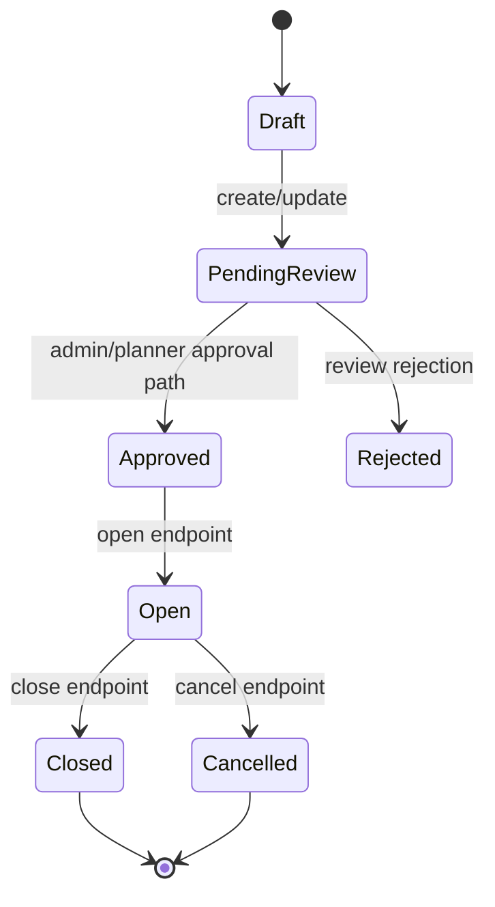
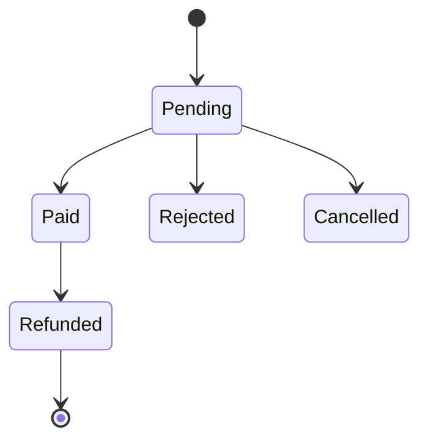
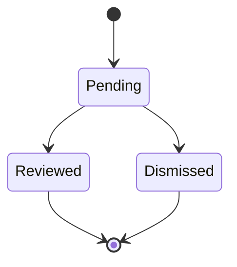

# State Machines

## Purpose
Document lifecycle state machines from enums and endpoint actions.

## Current implementation summary
This document was generated from the current repository snapshot. It references source paths where evidence exists and marks uncertain areas as Needs Verification.

## Important source files
- `src/Randevoo.Domain/Enums/BalanceTransactionType.cs`
- `src/Randevoo.Domain/Enums/EducationLevel.cs`
- `src/Randevoo.Domain/Enums/EventDiscountGenderScope.cs`
- `src/Randevoo.Domain/Enums/EventDiscountType.cs`
- `src/Randevoo.Domain/Enums/EventEducationLevelRestriction.cs`
- `src/Randevoo.Domain/Enums/EventLikeStatus.cs`
- `src/Randevoo.Domain/Enums/EventOperationalStatus.cs`
- `src/Randevoo.Domain/Enums/EventParticipantSmsRequestStatus.cs`
- `src/Randevoo.Domain/Enums/EventPaymentCollectionMethod.cs`
- `src/Randevoo.Domain/Enums/EventReviewStatus.cs`
- `src/Randevoo.Domain/Enums/Gender.cs`
- `src/Randevoo.Domain/Enums/ManualPaymentDestinationType.cs`
- `src/Randevoo.Domain/Enums/ManualPaymentReceiptStatus.cs`
- `src/Randevoo.Domain/Enums/ModerationReportReason.cs`
- `src/Randevoo.Domain/Enums/ModerationReportStatus.cs`
- `src/Randevoo.Domain/Enums/OnlinePaymentStatus.cs`
- `src/Randevoo.Domain/Enums/PlannerPayoutMethod.cs`
- `src/Randevoo.Domain/Enums/PlannerWithdrawalRequestStatus.cs`
- `src/Randevoo.Domain/Enums/SmsQueueItemStatus.cs`
- `src/Randevoo.Domain/Enums/SupportTicketCategory.cs`
- `src/Randevoo.Domain/Enums/SupportTicketStatus.cs`
- `src/Randevoo.Domain/Enums/SurveyFactor.cs`
- `src/Randevoo.Domain/Enums/TicketOrderPaymentStatus.cs`
- `src/Randevoo.Domain/Enums/TicketOrderStatus.cs`
- `src/Randevoo.Domain/Enums/UserRole.cs`

## Event operational/review state

## Payment/order state

## Moderation report state

Needs Verification: exact enum labels may differ; see enum catalog for authoritative values.

## Practical notes for developers
Use the linked source files as the authority. Validate behavior with tests before changing production code.

## Practical notes for future AI coding agents
Do not invent missing behavior. If a feature is represented only by docs or UI labels, mark it as partial until a handler, endpoint, entity, or test confirms it.
