# ERD

## Purpose
Mermaid ERD generated from entities and FK-like properties.

## Current implementation summary
This document was generated from the current repository snapshot. It references source paths where evidence exists and marks uncertain areas as Needs Verification.

## Important source files
- `src/Randevoo.Domain/Entities/AuditLog.cs`
- `src/Randevoo.Domain/Entities/BalanceAccount.cs`
- `src/Randevoo.Domain/Entities/BalanceTransaction.cs`
- `src/Randevoo.Domain/Entities/BalanceTransactionTypeLookup.cs`
- `src/Randevoo.Domain/Entities/City.cs`
- `src/Randevoo.Domain/Entities/Country.cs`
- `src/Randevoo.Domain/Entities/CurrencyExchangeRate.cs`
- `src/Randevoo.Domain/Entities/CurrencyLookup.cs`
- `src/Randevoo.Domain/Entities/DatingEvent.cs`
- `src/Randevoo.Domain/Entities/EducationLevelLookup.cs`
- `src/Randevoo.Domain/Entities/EventChatBlock.cs`
- `src/Randevoo.Domain/Entities/EventChatMessage.cs`
- `src/Randevoo.Domain/Entities/EventConversation.cs`
- `src/Randevoo.Domain/Entities/EventDiscountCode.cs`
- `src/Randevoo.Domain/Entities/EventDiscountTypeLookup.cs`
- `src/Randevoo.Domain/Entities/EventFaq.cs`
- `src/Randevoo.Domain/Entities/EventLike.cs`
- `src/Randevoo.Domain/Entities/EventModeLookup.cs`
- `src/Randevoo.Domain/Entities/EventParticipantSmsRequest.cs`
- `src/Randevoo.Domain/Entities/EventPlannerProfile.cs`
- `src/Randevoo.Domain/Entities/EventReviewStatusLookup.cs`
- `src/Randevoo.Domain/Entities/EventSurveyRating.cs`
- `src/Randevoo.Domain/Entities/EventSurveyResponse.cs`
- `src/Randevoo.Domain/Entities/EventTag.cs`
- `src/Randevoo.Domain/Entities/EventTicket.cs`

```mermaid
erDiagram
    AuditLog {
        long_ ActorUserId
        string_ ActorDisplayName
        string_ ActorRole
        string Action
        string LogType
        string_ Module
        string_ Description
        string TargetType
        string TargetId
        string_ BeforeJson
        string_ AfterJson
        string_ Reason
    }
    BalanceAccount {
        long UserId
        User User
        decimal Balance
        string ReportingCurrencyCode
    }
    BalanceTransaction {
        long BalanceAccountId
        BalanceAccount BalanceAccount
        long UserId
        decimal Amount
        string CurrencyCode
        string ReportingCurrencyCode
        decimal ReportingAmountIrr
        decimal ExchangeRateToIrr
        DateTime ExchangeRateCapturedAtUtc
        long_ ExchangeRateId
        CurrencyExchangeRate_ ExchangeRate
        BalanceTransactionType Type
    }
    BalanceTransactionTypeLookup {
        string Name
        string DisplayNameFa
        bool IsActive
        int DisplayOrder
    }
    City {
        long CountryId
        Country Country
        string Name
        bool IsActive
        int DisplayOrder
        decimal Latitude
        decimal Longitude
    }
    Country {
        string Name
        string Code
        bool IsActive
        int DisplayOrder
    }
    CurrencyExchangeRate {
        string FromCurrencyCode
        string ToCurrencyCode
        decimal Rate
        DateTime EffectiveFromUtc
        DateTime_ EffectiveToUtc
        string Source
        long_ CreatedByUserId
    }
    CurrencyLookup {
        string Code
        string DisplayNameFa
        string Symbol
        int DecimalPlaces
        bool IsActive
        int DisplayOrder
    }
    DatingEvent {
        string Title
        Location Location
        string Address
        DateTime DateTimeStart
        DateTime DateTimeEnd
        long EventTypeId
        EventType EventType
        long EventModeId
        EventModeLookup EventMode
        long_ OnlineEventPlatformId
        OnlineEventPlatform_ OnlineEventPlatform
        string_ OnlineJoinUrl
    }
    EducationLevelLookup {
        string Title
        int Rank
        bool IsActive
        int DisplayOrder
    }
    EventChatBlock {
        long EventConversationId
        EventConversation EventConversation
        long BlockerUserId
        User BlockerUser
        long BlockedUserId
        User BlockedUser
        bool IsActive
    }
    EventChatMessage {
        long EventConversationId
        EventConversation EventConversation
        long SenderUserId
        User SenderUser
        string Body
    }
    EventConversation {
        long DatingEventId
        DatingEvent DatingEvent
        long StarterUserId
        User StarterUser
        long ParticipantUserId
        User ParticipantUser
        bool IsDisabled
        string_ DisabledReason
        long_ DisabledByUserId
        DateTime_ DisabledAt
    }
    EventDiscountCode {
        long_ DatingEventId
        DatingEvent_ DatingEvent
        string Code
        string_ Title
        string_ Description
        EventDiscountGenderScope GenderScope
        EventDiscountType DiscountType
        decimal Value
        DateTime StartsAtUtc
        DateTime EndsAtUtc
        int MaxUsageCount
        int UsedCount
    }
    EventDiscountTypeLookup {
        string Name
        string DisplayNameFa
        bool IsActive
        int DisplayOrder
    }
    EventFaq {
        long DatingEventId
        DatingEvent DatingEvent
        string Question
        string Answer
        int DisplayOrder
    }
    EventLike {
        long DatingEventId
        DatingEvent DatingEvent
        long FromUserId
        User FromUser
        long ToUserId
        User ToUser
        EventLikeStatus Status
        DateTime_ RespondedAtUtc
    }
    EventModeLookup {
        string Name
        bool IsOnline
        bool IsActive
        int DisplayOrder
    }
    EventParticipantSmsRequest {
        long DatingEventId
        DatingEvent DatingEvent
        long RequestedByUserId
        User RequestedByUser
        string Message
        string_ ApprovedMessage
        DateTime_ PlannedSendAtUtc
        EventParticipantSmsRequestStatus Status
        string_ ReviewNote
        long_ ReviewedByAdminUserId
        User_ ReviewedByAdminUser
        DateTime_ ReviewedAt
    }
    EventPlannerProfile {
        long UserId
        User User
        string Title
        string_ PictureUrl
        string Resume
        string SettlementCurrencyCode
        DateTime_ SettlementCurrencyLockedAtUtc
        string_ SettlementCurrencyLockReason
        bool HasPendingChanges
        string_ PendingFullName
        string_ PendingCity
        string_ PendingTitle
    }
    EventReviewStatusLookup {
        string Name
        string DisplayNameFa
        bool IsActive
        int DisplayOrder
    }
    EventSurveyRating {
        long EventSurveyResponseId
        EventSurveyResponse EventSurveyResponse
        SurveyFactor Factor
        int Score
    }
    EventSurveyResponse {
        long DatingEventId
        DatingEvent DatingEvent
        long UserId
        User User
        string_ Comment
    }
    EventTag {
        long DatingEventId
        DatingEvent DatingEvent
        long TagId
        Tag Tag
    }
    EventTicket {
        long TicketOrderId
        TicketOrder TicketOrder
        long DatingEventId
        DatingEvent DatingEvent
        long UserId
        User User
        Gender Gender
        decimal OriginalPrice
        string CurrencyCode
        decimal ReportingOriginalPriceIrr
        decimal ReportingPriceIrr
        decimal ExchangeRateToIrr
    }
    EventType {
        string Name
        string_ Description
        bool IsActive
    }
    GenderLookup {
        string Title
        bool IsActive
        int DisplayOrder
    }
    Interest {
        string Name
        string_ Category
        int UsageCount
        ICollection_UserProfile_ UserProfiles
    }
    ManualPaymentReceipt {
        long DatingEventId
        DatingEvent DatingEvent
        long ParticipantUserId
        User ParticipantUser
        long PlannerUserId
        User PlannerUser
        long_ EventTicketId
        EventTicket_ EventTicket
        long_ TicketOrderId
        TicketOrder_ TicketOrder
        long_ EventDiscountCodeId
        EventDiscountCode_ EventDiscountCode
    }
    ModerationReport {
        long ReporterUserId
        User ReporterUser
        long ReportedUserId
        User ReportedUser
        long_ DatingEventId
        DatingEvent_ DatingEvent
        long_ EventConversationId
        EventConversation_ EventConversation
        ModerationReportReason Reason
        string Description
        ModerationReportStatus Status
        string_ AdminReviewNote
    }
    OnlineEventPlatform {
        string Name
        bool IsActive
        int DisplayOrder
    }
    OnlinePayment {
        long UserId
        User User
        long_ DatingEventId
        DatingEvent_ DatingEvent
        long_ EventTicketId
        EventTicket_ EventTicket
        long_ TicketOrderId
        TicketOrder_ TicketOrder
        long_ BalanceTransactionId
        BalanceTransaction_ BalanceTransaction
        decimal Amount
        string CurrencyCode
    }
    PermissionAction {
        string Entity
        string Action
        string Label
        string_ Description
        bool IsActive
        int DisplayOrder
    }
    PlannerBankAccount {
        long UserId
        User User
        string CurrencyCode
        PlannerPayoutMethod PayoutMethod
        string AccountHolderName
        string_ Country
        string_ CardNumber
        string_ Iban
        string_ BankName
        string_ AccountNumber
        string_ SwiftCode
        string_ AccountIdentifier
    }
    PlannerWithdrawalRequest {
        long UserId
        User User
        decimal Amount
        string CurrencyCode
        decimal ReportingAmountIrr
        decimal ExchangeRateToIrr
        DateTime ExchangeRateCapturedAtUtc
        long_ ExchangeRateId
        CurrencyExchangeRate_ ExchangeRate
        PlannerWithdrawalRequestStatus Status
        DateTime RequestedAtUtc
        DateTime_ ReviewedAtUtc
    }
    RefreshToken {
        long UserId
        string TokenHash
        DateTime ExpiresAt
        DateTime_ RevokedAt
        string_ ReplacedByTokenHash
        User User
    }
    RoleOperationPermission {
        UserRole Role
        string Entity
        string Action
        bool Allowed
    }
    SmsQueueItem {
        long_ EventParticipantSmsRequestId
        EventParticipantSmsRequest_ EventParticipantSmsRequest
        long DatingEventId
        DatingEvent DatingEvent
        long RecipientUserId
        User RecipientUser
        string MobileNumber
        string Message
        DateTime_ PlannedSendAtUtc
        SmsQueueItemStatus Status
        int AttemptCount
        DateTime_ SentAt
    }
    SupportTicket {
        string Title
        long TicketTypeId
        SupportTicketCategoryLookup TicketType
        long TicketStatusId
        SupportTicketStatusLookup TicketStatus
        long TicketRecipientTypeId
        SupportTicketRecipientTypeLookup TicketRecipientType
        SupportTicketCategory Category
        SupportTicketStatus Status
        long SubmitterUserId
        User SubmitterUser
        UserRole SubmitterRole
    }
    SupportTicketAssignmentCursor {
        string QueueName
        long_ LastAssignedUserId
    }
    SupportTicketAttachment {
        long SupportTicketMessageId
        SupportTicketMessage Message
        string FileName
        string ContentType
        long SizeBytes
        string Url
    }
    SupportTicketCategoryLookup {
        string Name
        string DisplayNameFa
        bool IsActive
        int DisplayOrder
    }
    SupportTicketHistoryEntry {
        long SupportTicketId
        SupportTicket SupportTicket
        long ActorUserId
        User ActorUser
        string Action
        SupportTicketStatus_ OldStatus
        SupportTicketStatus_ NewStatus
        long_ OldAssigneeUserId
        long_ NewAssigneeUserId
        string_ Note
    }
    SupportTicketMessage {
        long SupportTicketId
        SupportTicket SupportTicket
        long SenderUserId
        User SenderUser
        UserRole SenderRole
        long_ RepresentedUserId
        User_ RepresentedUser
        string Body
    }
    SupportTicketRecipientTypeLookup {
        string Name
        string DisplayNameFa
        bool IsActive
        int DisplayOrder
    }
    User ||--o{ UserProfile : references
    Gender ||--o{ UserProfile : references
    ZodiacSign ||--o{ UserProfile : references
    UserProfile ||--o{ UserProfileImage : references
    User ||--o{ EventPlannerProfile : references
    PendingReviewedByAdminUser ||--o{ EventPlannerProfile : references
    Country ||--o{ City : references
    CreatedByUser ||--o{ CurrencyExchangeRate : references
    User ||--o{ BalanceAccount : references
    BalanceAccount ||--o{ BalanceTransaction : references
    User ||--o{ BalanceTransaction : references
    ExchangeRate ||--o{ BalanceTransaction : references
    User ||--o{ OnlinePayment : references
    DatingEvent ||--o{ OnlinePayment : references
    EventTicket ||--o{ OnlinePayment : references
    DatingEvent ||--o{ ManualPaymentReceipt : references
    ParticipantUser ||--o{ ManualPaymentReceipt : references
    PlannerUser ||--o{ ManualPaymentReceipt : references
    User ||--o{ PlannerWithdrawalRequest : references
    ExchangeRate ||--o{ PlannerWithdrawalRequest : references
    ReviewedByAdminUser ||--o{ PlannerWithdrawalRequest : references
    User ||--o{ PlannerBankAccount : references
    EventType ||--o{ DatingEvent : references
    EventMode ||--o{ DatingEvent : references
    OnlineEventPlatform ||--o{ DatingEvent : references
    DatingEvent ||--o{ TicketOrder : references
    BuyerUser ||--o{ TicketOrder : references
    EventDiscountCode ||--o{ TicketOrder : references
    DatingEvent ||--o{ EventFaq : references
    DatingEvent ||--o{ EventDiscountCode : references
    DatingEvent ||--o{ EventTag : references
    Tag ||--o{ EventTag : references
    TicketOrder ||--o{ EventTicket : references
    DatingEvent ||--o{ EventTicket : references
    User ||--o{ EventTicket : references
    DatingEvent ||--o{ EventLike : references
    FromUser ||--o{ EventLike : references
    ToUser ||--o{ EventLike : references
    DatingEvent ||--o{ EventConversation : references
    StarterUser ||--o{ EventConversation : references
    ParticipantUser ||--o{ EventConversation : references
    EventConversation ||--o{ EventChatMessage : references
    SenderUser ||--o{ EventChatMessage : references
    EventConversation ||--o{ EventChatBlock : references
    BlockerUser ||--o{ EventChatBlock : references
    BlockedUser ||--o{ EventChatBlock : references
    DatingEvent ||--o{ EventSurveyResponse : references
    User ||--o{ EventSurveyResponse : references
    EventSurveyResponse ||--o{ EventSurveyRating : references
    ReporterUser ||--o{ ModerationReport : references
    ReportedUser ||--o{ ModerationReport : references
    DatingEvent ||--o{ ModerationReport : references
    TicketType ||--o{ SupportTicket : references
    TicketStatus ||--o{ SupportTicket : references
    TicketRecipientType ||--o{ SupportTicket : references
    SupportTicket ||--o{ SupportTicketMessage : references
    SenderUser ||--o{ SupportTicketMessage : references
    RepresentedUser ||--o{ SupportTicketMessage : references
    SupportTicketMessage ||--o{ SupportTicketAttachment : references
    SupportTicket ||--o{ SupportTicketHistoryEntry : references
    ActorUser ||--o{ SupportTicketHistoryEntry : references
    OldAssigneeUser ||--o{ SupportTicketHistoryEntry : references
    LastAssignedUser ||--o{ SupportTicketAssignmentCursor : references
    DatingEvent ||--o{ EventParticipantSmsRequest : references
    RequestedByUser ||--o{ EventParticipantSmsRequest : references
    ReviewedByAdminUser ||--o{ EventParticipantSmsRequest : references
    EventParticipantSmsRequest ||--o{ SmsQueueItem : references
    DatingEvent ||--o{ SmsQueueItem : references
    RecipientUser ||--o{ SmsQueueItem : references
    User ||--o{ RefreshToken : references
    ActorUser ||--o{ AuditLog : references
    Target ||--o{ AuditLog : references
    Correlation ||--o{ AuditLog : references
    User ||--o{ UserOperationPermissionOverride : references
```

Partial diagram note: Mermaid ERD is intentionally compact because the schema is large. See tables-and-fields for the full entity catalog.

## Practical notes for developers
Use the linked source files as the authority. Validate behavior with tests before changing production code.

## Practical notes for future AI coding agents
Do not invent missing behavior. If a feature is represented only by docs or UI labels, mark it as partial until a handler, endpoint, entity, or test confirms it.
