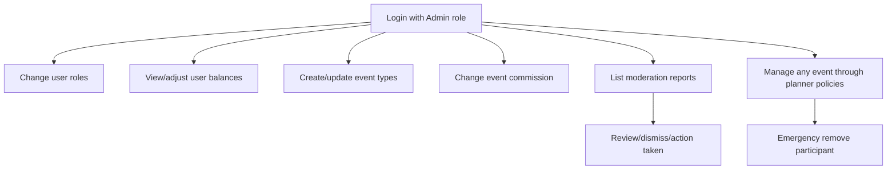

# FLOW-003 Admin Flow

```mermaid
flowchart TD
    Login[Login with Admin role] --> Roles[Change user roles]
    Login --> Balances[View/adjust user balances]
    Login --> EventTypes[Create/update event types]
    Login --> Commissions[Change event commission]
    Login --> Reports[List moderation reports]
    Reports --> Review[Review/dismiss/action taken]
    Login --> EventOps[Manage any event through planner policies]
    EventOps --> EmergencyRemove[Emergency remove participant]
```

## Notes

- Admin is included in `EndUserOnly` and `EventPlannerOnly` policies.
- Admin-only user details endpoint is not implemented beyond role changes and balance lookup.
