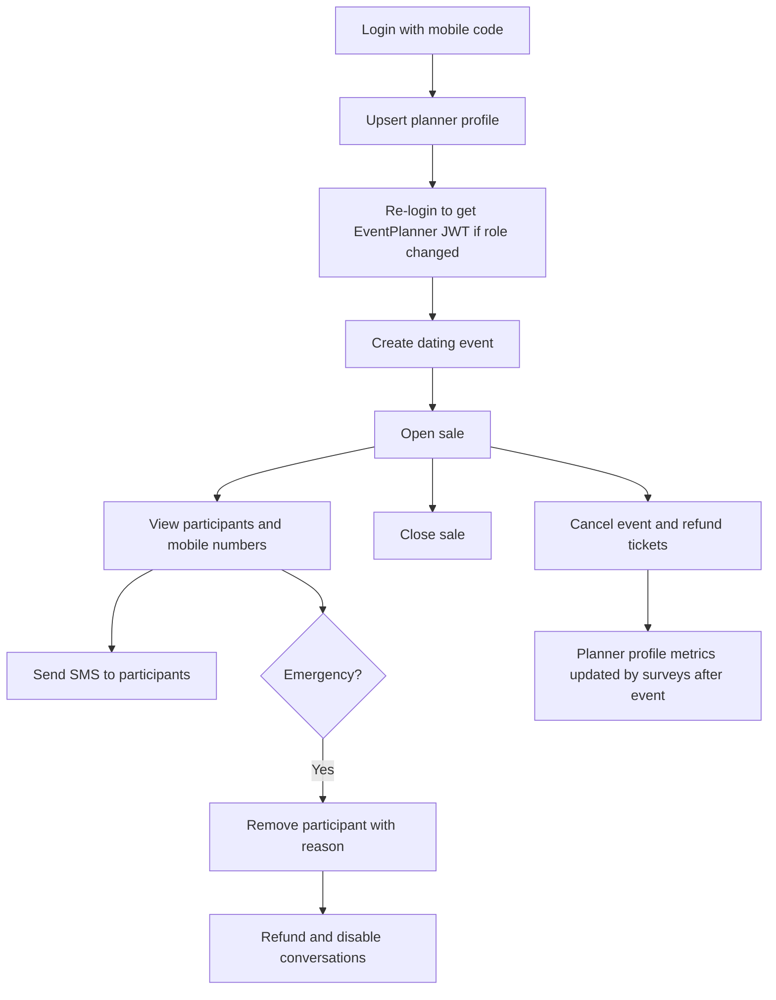

# FLOW-002 EventPlanner Flow

```mermaid
flowchart TD
    Login[Login with mobile code] --> PlannerProfile[Upsert planner profile]
    PlannerProfile --> ReLogin[Re-login to get EventPlanner JWT if role changed]
    ReLogin --> CreateEvent[Create dating event]
    CreateEvent --> OpenSale[Open sale]
    OpenSale --> Participants[View participants and mobile numbers]
    Participants --> Sms[Send SMS to participants]
    Participants --> Emergency{Emergency?}
    Emergency -- Yes --> Remove[Remove participant with reason]
    Remove --> Refund[Refund and disable conversations]
    OpenSale --> CloseSale[Close sale]
    OpenSale --> Cancel[Cancel event and refund tickets]
    Cancel --> Metrics[Planner profile metrics updated by surveys after event]
```

## Notes

- EventPlanner can manage owned events; Admin can manage any event.
- Participant list includes mobile number for emergency calls.
