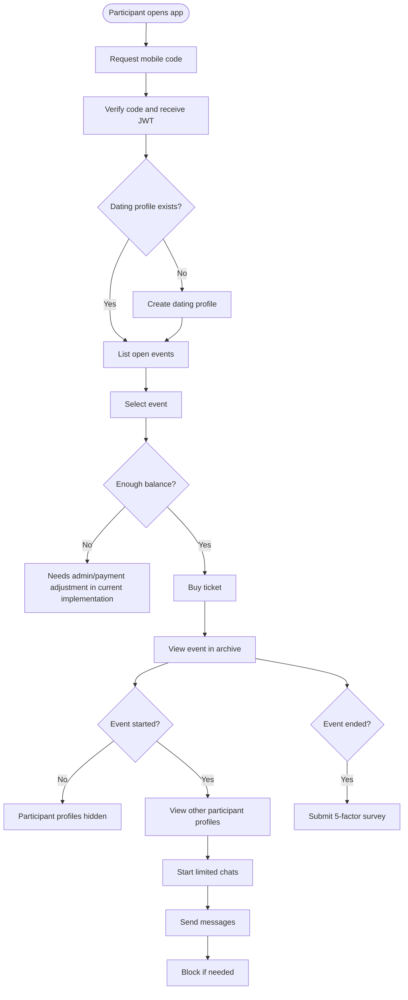

# FLOW-001 Participant Flow

```mermaid
flowchart TD
    Start([Participant opens app]) --> RequestCode[Request mobile code]
    RequestCode --> VerifyCode[Verify code and receive JWT]
    VerifyCode --> Profile{Dating profile exists?}
    Profile -- No --> CreateProfile[Create dating profile]
    Profile -- Yes --> Browse
    CreateProfile --> Browse[List open events]
    Browse --> SelectEvent[Select event]
    SelectEvent --> Balance{Enough balance?}
    Balance -- No --> NeedFunds[Needs admin/payment adjustment in current implementation]
    Balance -- Yes --> BuyTicket[Buy ticket]
    BuyTicket --> Archive[View event in archive]
    Archive --> EventStart{Event started?}
    EventStart -- No --> Wait[Participant profiles hidden]
    EventStart -- Yes --> ViewProfiles[View other participant profiles]
    ViewProfiles --> Chat[Start limited chats]
    Chat --> Message[Send messages]
    Message --> Block[Block if needed]
    Archive --> EventEnd{Event ended?}
    EventEnd -- Yes --> Survey[Submit 5-factor survey]
```

## Notes

- Public profile DTOs do not expose phone/email.
- Current code has no payment provider; admin adjustment is used by tests to fund balances.
