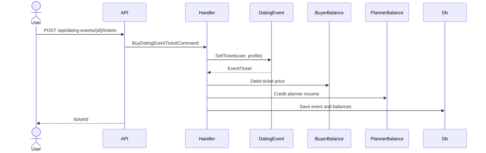
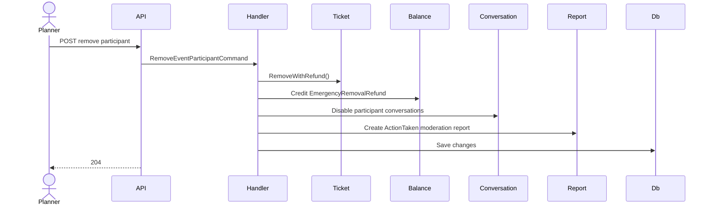

# System Flows

## FLOW-004 Ticket Purchase



## FLOW-005 Emergency Removal



## FLOW-006 Survey Updates Planner Quality

```mermaid
sequenceDiagram
    actor Participant
    participant API
    participant Handler
    participant Survey
    participant PlannerProfile
    participant Db

    Participant->>API: POST /api/event-surveys/events/{id}/me
    API->>Handler: SubmitEventSurveyCommand
    Handler->>Survey: Create or update ratings
    Handler->>Db: Save survey
    Handler->>PlannerProfile: UpdateMetrics()
    Handler->>Db: Save metrics
    API-->>Participant: EventSurveyDto
```
