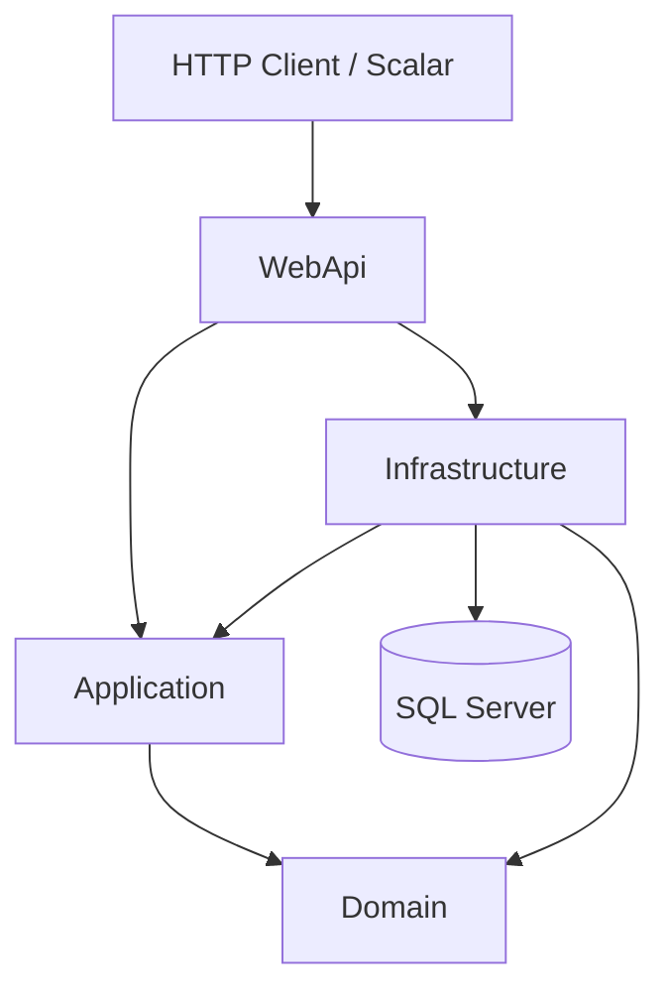
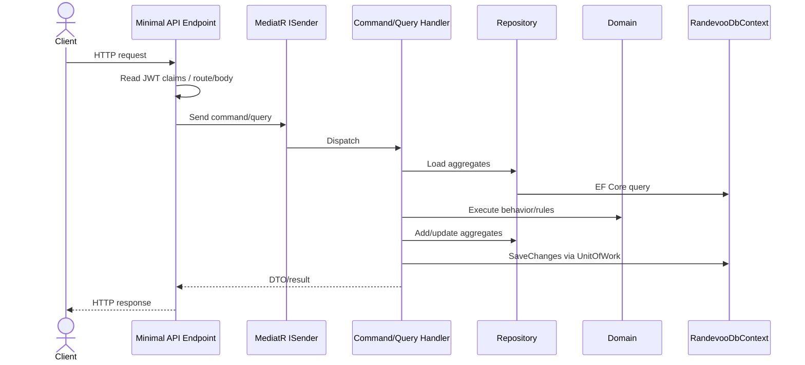

# Architecture Overview

## Clean Architecture Mapping

## Layer Responsibilities

| Layer | Responsibility |
|---|---|
| Domain | Business entities, value objects, rules, domain events, repository contracts |
| Application | CQRS command/query handlers, DTO mapping, workflow orchestration |
| Infrastructure | EF Core, repositories, unit of work, JWT service, SMS/email implementations |
| WebApi | HTTP routing, auth policies, minimal API request/response boundary |
| Tests | Unit and integration test coverage |

## Request Flow

## Dependency Direction

- Application depends on Domain.
- Infrastructure depends on Application and Domain.
- WebApi depends on all production layers to compose services and map endpoints.
- Domain does not depend on Infrastructure or WebApi.

## Authentication and Authorization

- JWT bearer auth is configured in `Program.cs`.
- JWT includes `ClaimTypes.NameIdentifier`, `mobile_number`, and role claim.
- Policies:
  - `EndUserOnly`: `EndUser`, `Admin`
  - `EventPlannerOnly`: `EventPlanner`, `Admin`
  - `AdminOnly`: `Admin`

## Integrations

- SQL Server is configured through `AddRandevooInfrastructure(connectionString)`.
- `ConsoleSmsSender` and `ConsoleEmailSender` are placeholder notification implementations.
- Scalar is mapped only in Development.

## TODO / Assumption Required

- No centralized validation pipeline is configured; validation is mostly domain guards and handler checks.
- No domain event dispatch pipeline exists.
- No production notification provider exists.
