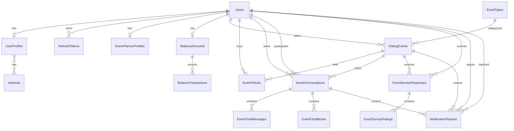

# Database Design

Source: `RandevooDbContext` EF Core mappings and migrations.

## Tables

| Table | Primary Key | Notes |
|---|---|---|
| `Users` | `Id` | unique mobile, nullable unique email, auth fields, role |
| `RefreshTokens` | `Id` | hashed refresh tokens, expiry, rotation/revocation state |
| `UserProfiles` | `Id` | one-to-one user profile, owned height/location columns |
| `Interests` | `Id` | unique name, usage count |
| `UserProfileInterests` | `UserProfileId`, `InterestId` | many-to-many join |
| `EventPlannerProfiles` | `Id` | unique user id, planner quality metrics |
| `BalanceAccounts` | `Id` | unique user id, balance |
| `BalanceTransactions` | `Id` | account ledger entries |
| `DatingEvents` | `Id` | planner-owned events, owned location and age ranges, FK to event type |
| `EventTickets` | `Id` | unique event/user ticket |
| `EventConversations` | `Id` | unique event/starter/participant tuple |
| `EventChatMessages` | `Id` | messages per conversation |
| `EventChatBlocks` | `Id` | unique conversation/blocker/blocked tuple |
| `EventSurveyResponses` | `Id` | unique event/user survey |
| `EventSurveyRatings` | `Id` | unique survey/factor rating |
| `EventTypes` | `Id` | unique event type name, seeded lookup |
| `ModerationReports` | `Id` | user reports and emergency-removal audit records |
| `__EFMigrationsHistory` | `MigrationId` | EF Core migration tracking |

## Important Indexes and Constraints

- `Users.MobileNumber` unique.
- `Users.Email` unique when not null.
- `RefreshTokens.TokenHash` unique.
- `RefreshTokens.UserId` indexed.
- `UserProfiles.DisplayName` unique.
- `UserProfiles.UserId` unique.
- `EventPlannerProfiles.UserId` unique.
- `BalanceAccounts.UserId` unique.
- `EventTickets(DatingEventId, UserId)` unique.
- `EventConversations(DatingEventId, StarterUserId, ParticipantUserId)` unique.
- `EventChatBlocks(EventConversationId, BlockerUserId, BlockedUserId)` unique.
- `EventSurveyResponses(DatingEventId, UserId)` unique.
- `EventSurveyRatings(EventSurveyResponseId, Factor)` unique.
- `EventTypes.Name` unique.
- `DatingEvents.EventTypeId` references `EventTypes.Id`.
- Soft-delete query filters exist on most aggregate tables.

## ERD

## Seed Data

`EventTypes` seeds:

- Mafia
- Board Game
- Poem Reading
- Cafe Meetup
- Hiking
- Speed Dating
- Game Tournament
- Workshop
- Art Night
- Music Night

## TODO

- Review whether query filters on child tables should include parent soft-delete only or child `IsDeleted` too.
