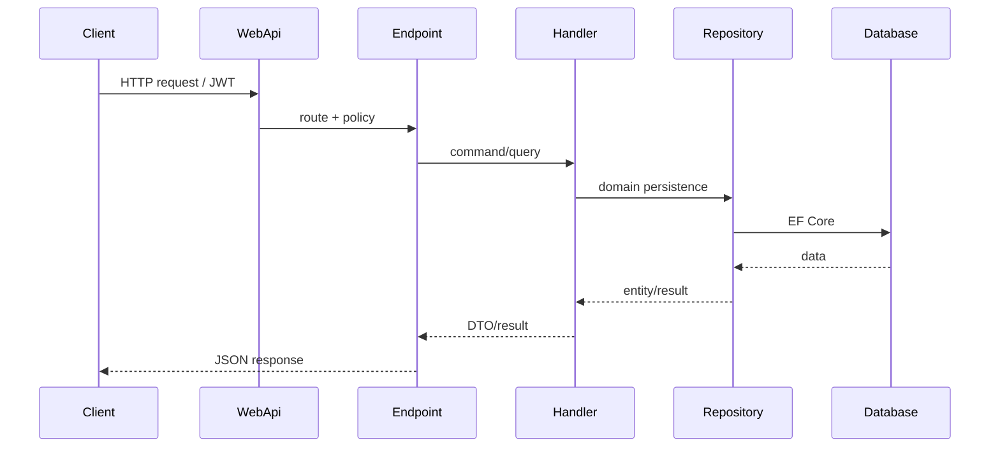

# API Overview

## Purpose
Summarize API surface and communication patterns.

## Current implementation summary
This document was generated from the current repository snapshot. It references source paths where evidence exists and marks uncertain areas as Needs Verification.

## Important source files
- `src/Randevoo.WebApi/Endpoints`
- `src/Randevoo.WebApi/Hubs/EventChatHub.cs`

The WebApi exposes 54 detected Minimal API routes grouped by feature, plus SignalR hub(s). Authentication uses JWT bearer tokens and policy-based authorization.

## Practical notes for developers
Use the linked source files as the authority. Validate behavior with tests before changing production code.

## Practical notes for future AI coding agents
Do not invent missing behavior. If a feature is represented only by docs or UI labels, mark it as partial until a handler, endpoint, entity, or test confirms it.
