# Sitemap

## Purpose
Render detected Razor Pages routes as a Mermaid sitemap.

## Current implementation summary
This document was generated from the current repository snapshot. It references source paths where evidence exists and marks uncertain areas as Needs Verification.

## Important source files
- `src/Randevoo.AdminPanel/Pages/Account/Forbidden.cshtml`
- `src/Randevoo.AdminPanel/Pages/Account/Login.cshtml`
- `src/Randevoo.AdminPanel/Pages/Account/Logout.cshtml`
- `src/Randevoo.AdminPanel/Pages/Buyers/Index.cshtml`
- `src/Randevoo.AdminPanel/Pages/Dashboard/Events.cshtml`
- `src/Randevoo.AdminPanel/Pages/Dashboard/Index.cshtml`
- `src/Randevoo.AdminPanel/Pages/Dashboard/Money.cshtml`
- `src/Randevoo.AdminPanel/Pages/Dashboard/My.cshtml`
- `src/Randevoo.AdminPanel/Pages/Dashboard/Sales.cshtml`
- `src/Randevoo.AdminPanel/Pages/Dashboard/Users.cshtml`
- `src/Randevoo.AdminPanel/Pages/DiscountCodes/Index.cshtml`
- `src/Randevoo.AdminPanel/Pages/Error.cshtml`
- `src/Randevoo.AdminPanel/Pages/EventTypes/Index.cshtml`
- `src/Randevoo.AdminPanel/Pages/Events/Buyers.cshtml`
- `src/Randevoo.AdminPanel/Pages/Events/Conversation.cshtml`
- `src/Randevoo.AdminPanel/Pages/Events/Conversations.cshtml`
- `src/Randevoo.AdminPanel/Pages/Events/Details.cshtml`
- `src/Randevoo.AdminPanel/Pages/Events/Edit.cshtml`
- `src/Randevoo.AdminPanel/Pages/Events/Faqs.cshtml`
- `src/Randevoo.AdminPanel/Pages/Events/Index.cshtml`
- `src/Randevoo.AdminPanel/Pages/Events/My.cshtml`
- `src/Randevoo.AdminPanel/Pages/Events/Sms.cshtml`
- `src/Randevoo.AdminPanel/Pages/Events/SurveyRatings.cshtml`
- `src/Randevoo.AdminPanel/Pages/Finance/Index.cshtml`
- `src/Randevoo.AdminPanel/Pages/Finance/My.cshtml`
- `src/Randevoo.AdminPanel/Pages/Finance/PaymentReceipts.cshtml`
- `src/Randevoo.AdminPanel/Pages/Finance/ReceivedReceipts.cshtml`
- `src/Randevoo.AdminPanel/Pages/Finance/TicketTransactions.cshtml`
- `src/Randevoo.AdminPanel/Pages/Finance/User.cshtml`
- `src/Randevoo.AdminPanel/Pages/Finance/Withdrawals.cshtml`

```mermaid
graph TD
  AdminPanel["AdminPanel"]
    P0["/Account/Forbidden"]
    P1["/Account/Login"]
    P2["/Account/Logout"]
    P3["/Buyers"]
    P4["/Dashboard/Events"]
    P5["/Dashboard"]
    P6["/Dashboard/Money"]
    P7["/Dashboard/My"]
    P8["/Dashboard/Sales"]
    P9["/Dashboard/Users"]
    P10["/DiscountCodes"]
    P11["/Error"]
    P12["/EventTypes"]
    P13["/Events/Buyers"]
    P14["/Events/Conversation"]
    P15["/Events/Conversations"]
    P16["/Events/Details"]
    P17["/Events/Edit"]
    P18["/Events/Faqs"]
    P19["/Events"]
    P20["/Events/My"]
    P21["/Events/Sms"]
    P22["/Events/SurveyRatings"]
    P23["/Finance"]
    P24["/Finance/My"]
    P25["/Finance/PaymentReceipts"]
    P26["/Finance/ReceivedReceipts"]
    P27["/Finance/TicketTransactions"]
    P28["/Finance/User"]
    P29["/Finance/Withdrawals"]
    P30["/"]
    P31["/Logs"]
    P32["/Logs/SmsQueue"]
    P33["/Participants"]
    P34["/Planner/Approvals"]
    P35["/Planner/BankAccounts"]
    P36["/Planner/Details"]
    P37["/Planner"]
    P38["/Planner/Profile"]
    P39["/Planner/Review"]
    P40["/Privacy"]
    P41["/Public/Event"]
    P42["/Settings"]
    P43["/Settings/OperationPermissions"]
    P44["/Shared/_DashboardRangeFilter"]
    P45["/Shared/_EventImageSlider"]
    P46["/Shared/_Layout"]
    P47["/Shared/_SidebarNav"]
    P48["/Shared/_Topbar"]
    P49["/Shared/_ValidationScriptsPartial"]
    P50["/Support/Create"]
    P51["/Support/Details"]
    P52["/Support"]
    P53["/Support/My"]
    P54["/Support/Received"]
    P55["/Support/Tickets"]
    P56["/Tags"]
    P57["/UserProfiles/AdminEdit"]
    P58["/UserProfiles/Details"]
    P59["/UserProfiles"]
    P60["/Users"]
    P61["/_ViewImports"]
    P62["/_ViewStart"]
    AdminPanel --> P0
    AdminPanel --> P1
    AdminPanel --> P2
    AdminPanel --> P3
    AdminPanel --> P4
    AdminPanel --> P5
    AdminPanel --> P6
    AdminPanel --> P7
    AdminPanel --> P8
    AdminPanel --> P9
    AdminPanel --> P10
    AdminPanel --> P11
    AdminPanel --> P12
    AdminPanel --> P13
    AdminPanel --> P14
    AdminPanel --> P15
    AdminPanel --> P16
    AdminPanel --> P17
    AdminPanel --> P18
    AdminPanel --> P19
    AdminPanel --> P20
    AdminPanel --> P21
    AdminPanel --> P22
    AdminPanel --> P23
    AdminPanel --> P24
    AdminPanel --> P25
    AdminPanel --> P26
    AdminPanel --> P27
    AdminPanel --> P28
    AdminPanel --> P29
    AdminPanel --> P30
    AdminPanel --> P31
    AdminPanel --> P32
    AdminPanel --> P33
    AdminPanel --> P34
    AdminPanel --> P35
    AdminPanel --> P36
    AdminPanel --> P37
    AdminPanel --> P38
    AdminPanel --> P39
    AdminPanel --> P40
    AdminPanel --> P41
    AdminPanel --> P42
    AdminPanel --> P43
    AdminPanel --> P44
    AdminPanel --> P45
    AdminPanel --> P46
    AdminPanel --> P47
    AdminPanel --> P48
    AdminPanel --> P49
    AdminPanel --> P50
    AdminPanel --> P51
    AdminPanel --> P52
    AdminPanel --> P53
    AdminPanel --> P54
    AdminPanel --> P55
    AdminPanel --> P56
    AdminPanel --> P57
    AdminPanel --> P58
    AdminPanel --> P59
    AdminPanel --> P60
    AdminPanel --> P61
    AdminPanel --> P62
```

## Practical notes for developers
Use the linked source files as the authority. Validate behavior with tests before changing production code.

## Practical notes for future AI coding agents
Do not invent missing behavior. If a feature is represented only by docs or UI labels, mark it as partial until a handler, endpoint, entity, or test confirms it.
