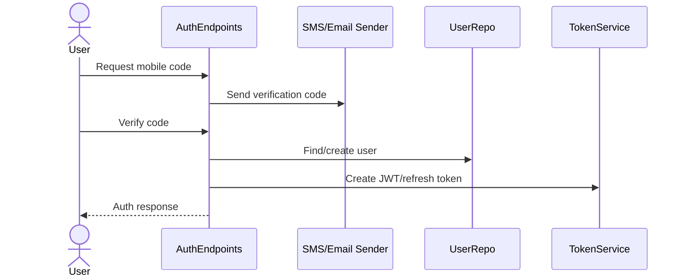

# Registration Flow

## Purpose
Document registration flow from current code evidence.

## Current implementation summary
This document was generated from the current repository snapshot. It references source paths where evidence exists and marks uncertain areas as Needs Verification.

## Important source files
- `src/Randevoo.WebApi/Endpoints/AuthEndpoints.cs`
- `src/Randevoo.Infrastructure/Services/JwtTokenService.cs`

## Gaps or uncertainties
- No additional gaps beyond the repository evidence listed here.

## Practical notes for developers
Use the linked source files as the authority. Validate behavior with tests before changing production code.

## Practical notes for future AI coding agents
Do not invent missing behavior. If a feature is represented only by docs or UI labels, mark it as partial until a handler, endpoint, entity, or test confirms it.
