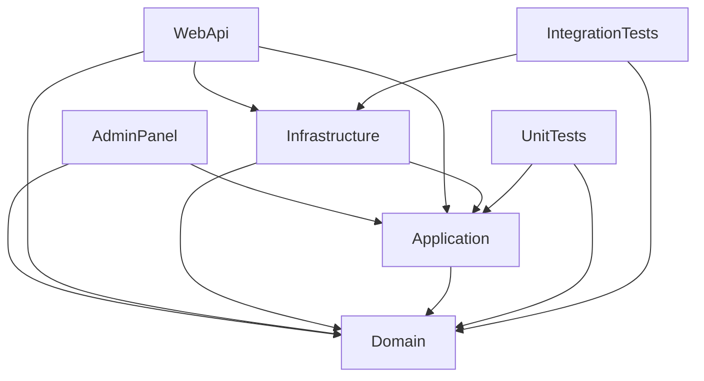

# Architecture Overview

## Purpose
Describe system architecture and layer communication.

## Current implementation summary
This document was generated from the current repository snapshot. It references source paths where evidence exists and marks uncertain areas as Needs Verification.

## Important source files
- `Randevoo.sln`
- `src/Randevoo.AdminPanel/Randevoo.AdminPanel.csproj`
- `src/Randevoo.Application/Randevoo.Application.csproj`
- `src/Randevoo.Domain/Randevoo.Domain.csproj`
- `src/Randevoo.Infrastructure/Randevoo.Infrastructure.csproj`
- `src/Randevoo.WebApi/Randevoo.WebApi.csproj`
- `tests/Randevoo.Tests.Integration/Randevoo.Tests.Integration.csproj`
- `tests/Randevoo.Tests.Unit/Randevoo.Tests.Unit.csproj`

The architecture is a layered .NET monolith/API plus admin UI. Domain contains core concepts, Application coordinates use cases, Infrastructure implements persistence and external adapters, WebApi exposes API routes, and AdminPanel offers operational screens.

## Practical notes for developers
Use the linked source files as the authority. Validate behavior with tests before changing production code.

## Practical notes for future AI coding agents
Do not invent missing behavior. If a feature is represented only by docs or UI labels, mark it as partial until a handler, endpoint, entity, or test confirms it.
