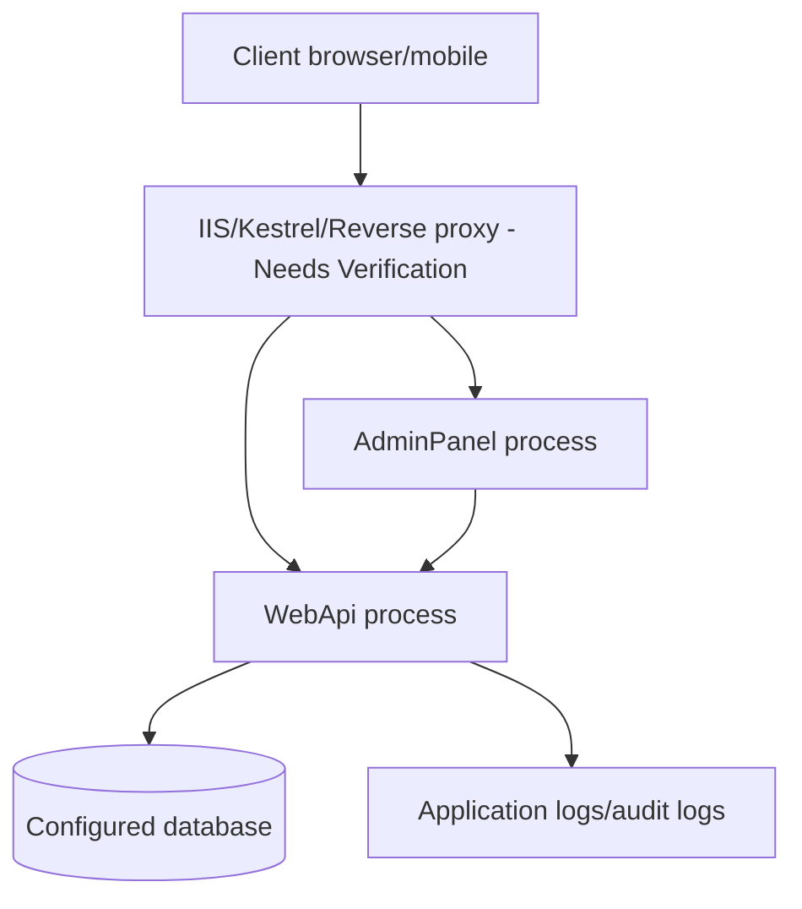

# Deployment Diagram

## Purpose
Deployment view based on launch/config evidence.

## Current implementation summary
This document was generated from the current repository snapshot. It references source paths where evidence exists and marks uncertain areas as Needs Verification.

## Important source files
- `src/Randevoo.AdminPanel/Properties/launchSettings.json`
- `src/Randevoo.AdminPanel/appsettings.Development.json`
- `src/Randevoo.AdminPanel/appsettings.json`
- `src/Randevoo.WebApi/Properties/launchSettings.json`
- `src/Randevoo.WebApi/appsettings.Development.json`
- `src/Randevoo.WebApi/appsettings.Production.example.json`
- `src/Randevoo.WebApi/appsettings.json`

## Gaps or uncertainties
- No Dockerfile or CI workflow was detected in the extracted file inventory unless added outside inspected paths.

## Practical notes for developers
Use the linked source files as the authority. Validate behavior with tests before changing production code.

## Practical notes for future AI coding agents
Do not invent missing behavior. If a feature is represented only by docs or UI labels, mark it as partial until a handler, endpoint, entity, or test confirms it.
