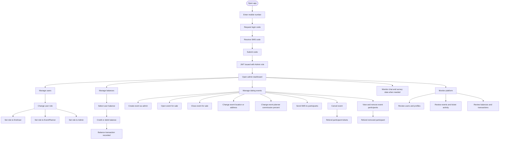

# Admin User Flow

## Main Permissions

- Can login with mobile number and SMS code.
- Can change user roles.
- Can adjust user balances.
- Can create and manage dating events.
- Can change event commission percent.
- Can open, close, cancel, and refund events.
- Can send SMS messages to event participants.
- Can act across users and planners.
