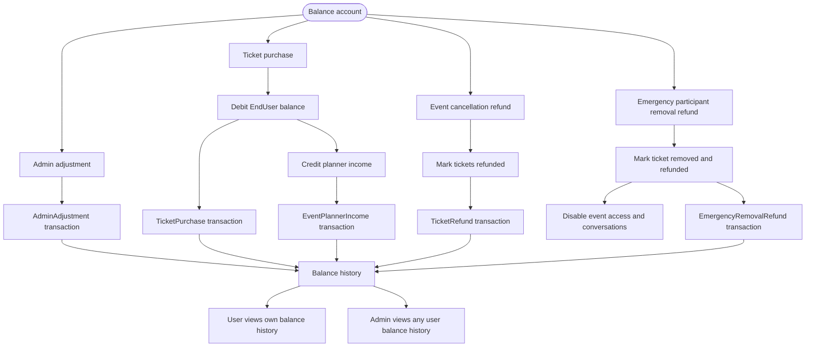

# Balance and Refund Flow

## Transaction Fields

- `Amount`
- `Type`
- `Description`
- `DatingEventId`
- `ReferenceType`
- `ReferenceId`
- `CreatedByUserId`
- `CreatedAt`

## Rules

- Balance cannot go negative.
- Every refund creates a transaction.
- Emergency removal refunds use `EmergencyRemovalRefund`, separate from normal `TicketRefund`.
- Admins can view any user balance history.
- EndUsers and EventPlanners can view their own balance history.
