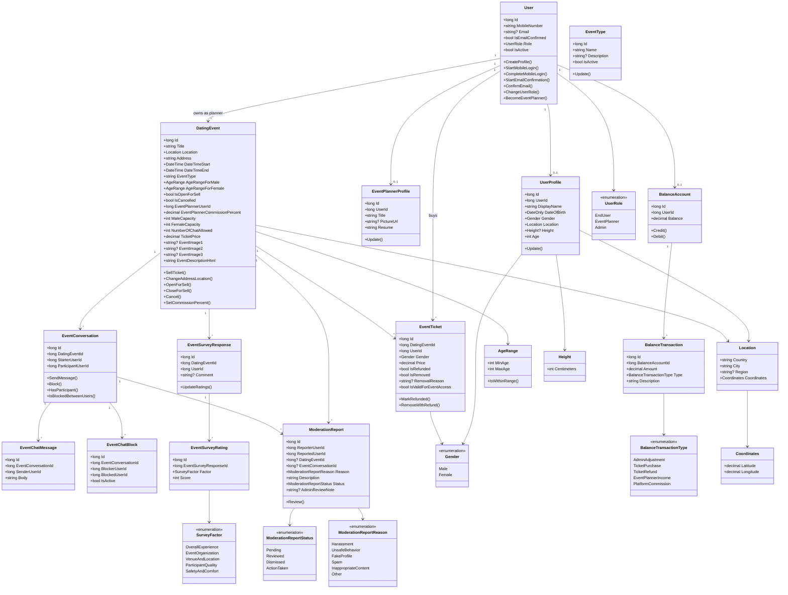

# Randevoo Class Diagram

```mermaid
classDiagram
    class User {
        +long Id
        +string MobileNumber
        +string? Email
        +bool IsEmailConfirmed
        +UserRole Role
        +bool IsActive
        +CreateProfile()
        +StartMobileLogin()
        +CompleteMobileLogin()
        +StartEmailConfirmation()
        +ConfirmEmail()
        +ChangeUserRole()
        +BecomeEventPlanner()
    }

    class UserProfile {
        +long Id
        +long UserId
        +string DisplayName
        +DateOnly DateOfBirth
        +Gender Gender
        +Location Location
        +Height? Height
        +int Age
        +Update()
    }

    class EventPlannerProfile {
        +long Id
        +long UserId
        +string Title
        +string? PictureUrl
        +string Resume
        +Update()
    }

    class BalanceAccount {
        +long Id
        +long UserId
        +decimal Balance
        +Credit()
        +Debit()
    }

    class BalanceTransaction {
        +long Id
        +long BalanceAccountId
        +decimal Amount
        +BalanceTransactionType Type
        +string Description
    }

    class DatingEvent {
        +long Id
        +string Title
        +Location Location
        +string Address
        +DateTime DateTimeStart
        +DateTime DateTimeEnd
        +string EventType
        +AgeRange AgeRangeForMale
        +AgeRange AgeRangeForFemale
        +bool IsOpenForSell
        +bool IsCancelled
        +long EventPlannerUserId
        +decimal EventPlannerCommissionPercent
        +int MaleCapacity
        +int FemaleCapacity
        +int NumberOfChatAllowed
        +decimal TicketPrice
        +string? EventImage1
        +string? EventImage2
        +string? EventImage3
        +string EventDescriptionHtml
        +SellTicket()
        +ChangeAddressLocation()
        +OpenForSell()
        +CloseForSell()
        +Cancel()
        +SetCommissionPercent()
    }

    class EventTicket {
        +long Id
        +long DatingEventId
        +long UserId
        +Gender Gender
        +decimal Price
        +bool IsRefunded
        +bool IsRemoved
        +string? RemovalReason
        +bool IsValidForEventAccess
        +MarkRefunded()
        +RemoveWithRefund()
    }

    class EventConversation {
        +long Id
        +long DatingEventId
        +long StarterUserId
        +long ParticipantUserId
        +SendMessage()
        +Block()
        +HasParticipant()
        +IsBlockedBetweenUsers()
    }

    class EventChatMessage {
        +long Id
        +long EventConversationId
        +long SenderUserId
        +string Body
    }

    class EventChatBlock {
        +long Id
        +long EventConversationId
        +long BlockerUserId
        +long BlockedUserId
        +bool IsActive
    }

    class EventSurveyResponse {
        +long Id
        +long DatingEventId
        +long UserId
        +string? Comment
        +UpdateRatings()
    }

    class EventSurveyRating {
        +long Id
        +long EventSurveyResponseId
        +SurveyFactor Factor
        +int Score
    }

    class EventType {
        +long Id
        +string Name
        +string? Description
        +bool IsActive
        +Update()
    }

    class ModerationReport {
        +long Id
        +long ReporterUserId
        +long ReportedUserId
        +long? DatingEventId
        +long? EventConversationId
        +ModerationReportReason Reason
        +string Description
        +ModerationReportStatus Status
        +string? AdminReviewNote
        +Review()
    }

    class UserRole {
        <<enumeration>>
        EndUser
        EventPlanner
        Admin
    }

    class Gender {
        <<enumeration>>
        Male
        Female
    }

    class BalanceTransactionType {
        <<enumeration>>
        AdminAdjustment
        TicketPurchase
        TicketRefund
        EventPlannerIncome
        PlatformCommission
    }

    class SurveyFactor {
        <<enumeration>>
        OverallExperience
        EventOrganization
        VenueAndLocation
        ParticipantQuality
        SafetyAndComfort
    }

    class ModerationReportStatus {
        <<enumeration>>
        Pending
        Reviewed
        Dismissed
        ActionTaken
    }

    class ModerationReportReason {
        <<enumeration>>
        Harassment
        UnsafeBehavior
        FakeProfile
        Spam
        InappropriateContent
        Other
    }

    class Location {
        +string Country
        +string City
        +string? Region
        +Coordinates Coordinates
    }

    class Coordinates {
        +decimal Latitude
        +decimal Longitude
    }

    class AgeRange {
        +int MinAge
        +int MaxAge
        +IsWithinRange()
    }

    class Height {
        +int Centimeters
    }

    User "1" --> "0..1" UserProfile
    User "1" --> "0..1" EventPlannerProfile
    User "1" --> "0..1" BalanceAccount
    User "1" --> "*" DatingEvent : owns as planner
    User "1" --> "*" EventTicket : buys

    BalanceAccount "1" --> "*" BalanceTransaction
    DatingEvent "1" --> "*" EventTicket
    DatingEvent "1" --> "*" EventConversation
    EventConversation "1" --> "*" EventChatMessage
    EventConversation "1" --> "*" EventChatBlock
    DatingEvent "1" --> "*" EventSurveyResponse
    EventSurveyResponse "1" --> "*" EventSurveyRating
    DatingEvent "1" --> "*" ModerationReport
    EventConversation "1" --> "*" ModerationReport

    User --> UserRole
    UserProfile --> Gender
    UserProfile --> Location
    UserProfile --> Height

    DatingEvent --> Location
    DatingEvent --> AgeRange
    EventTicket --> Gender
    BalanceTransaction --> BalanceTransactionType
    EventSurveyRating --> SurveyFactor
    ModerationReport --> ModerationReportStatus
    ModerationReport --> ModerationReportReason
    Location --> Coordinates
```
