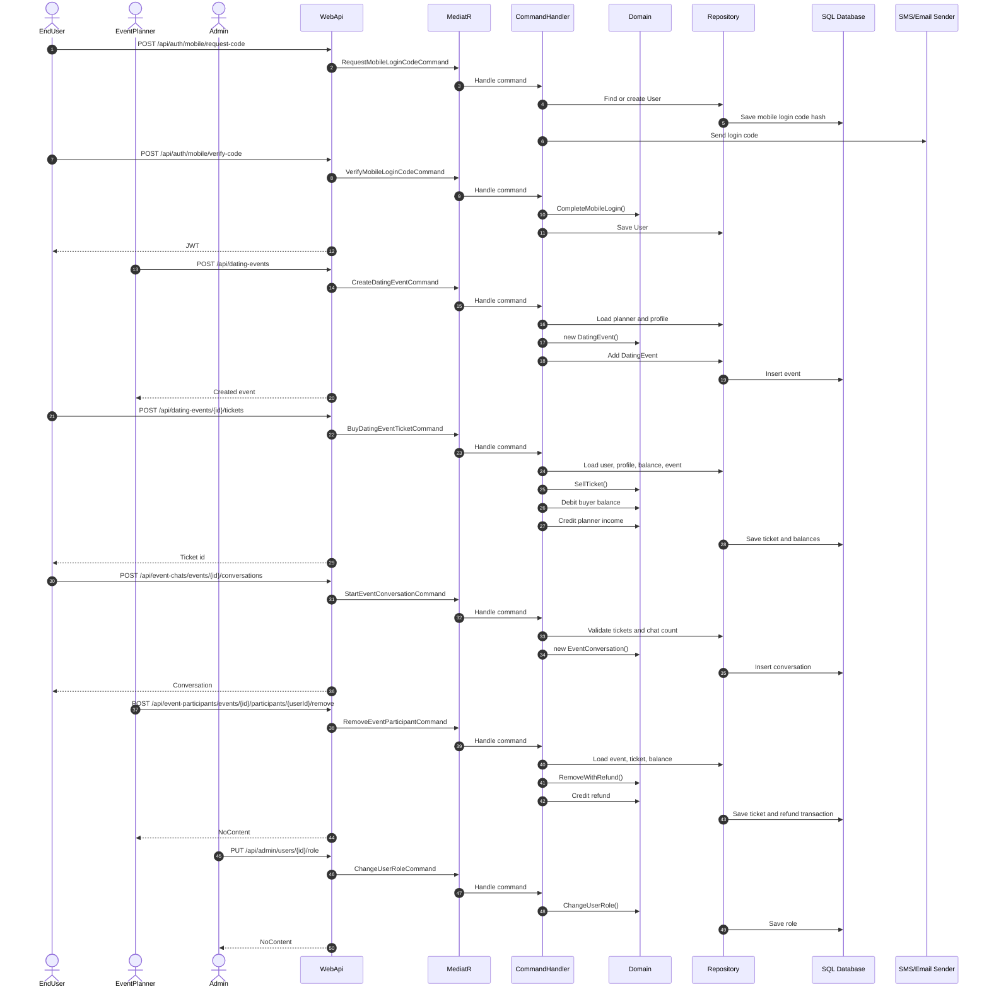

# Collaboration Diagram

## Collaboration Notes

- WebApi endpoints stay thin and delegate behavior to MediatR.
- Application handlers coordinate repositories and domain behavior.
- Domain entities enforce business rules.
- Infrastructure persists aggregates and sends notifications.
