# Component Diagram

```mermaid
flowchart TB
    Browser[Client / Scalar / Future UI]

    subgraph WebApi[Randevoo.WebApi]
        AuthEndpoints[AuthEndpoints]
        DatingProfileEndpoints[DatingProfileEndpoints]
        EventPlannerProfileEndpoints[EventPlannerProfileEndpoints]
        DatingEventEndpoints[DatingEventEndpoints]
        EventParticipantEndpoints[EventParticipantEndpoints]
        EventChatEndpoints[EventChatEndpoints]
        EventSurveyEndpoints[EventSurveyEndpoints]
        BalanceEndpoints[BalanceEndpoints]
        UserAdminEndpoints[UserAdminEndpoints]
        JwtAuth[JWT Authentication and Policies]
    end

    subgraph Application[Randevoo.Application]
        MediatR[MediatR]
        AuthCQRS[Auth CQRS]
        ProfileCQRS[Profile CQRS]
        EventCQRS[DatingEvent CQRS]
        ParticipantCQRS[Participant CQRS]
        ChatCQRS[Chat CQRS]
        SurveyCQRS[Survey CQRS]
        ModerationCQRS[Moderation CQRS]
        EventTypeCQRS[EventType CQRS]
        BalanceCQRS[Balance CQRS]
        UserCQRS[User/Admin CQRS]
        NotificationContracts[Notification Interfaces]
    end

    subgraph Domain[Randevoo.Domain]
        UserAggregate[User]
        UserProfileAggregate[UserProfile]
        EventPlannerProfileAggregate[EventPlannerProfile]
        DatingEventAggregate[DatingEvent]
        EventTicketEntity[EventTicket]
        BalanceAggregate[BalanceAccount]
        ChatAggregate[EventConversation]
        SurveyAggregate[EventSurveyResponse]
        ModerationAggregate[ModerationReport]
        EventTypeAggregate[EventType]
        ValueObjects[Location / Coordinates / AgeRange / Height]
        DomainRules[Domain Rules and Guards]
    end

    subgraph Infrastructure[Randevoo.Infrastructure]
        DbContext[RandevooDbContext]
        Repositories[Repositories]
        JwtService[JwtTokenService]
        SmsSender[ConsoleSmsSender]
        EmailSender[ConsoleEmailSender]
        UnitOfWork[UnitOfWork]
        Migrations[EF Core Migrations]
    end

    Sql[(SQL Server Database)]

    Browser --> WebApi
    WebApi --> JwtAuth
    AuthEndpoints --> MediatR
    DatingProfileEndpoints --> MediatR
    EventPlannerProfileEndpoints --> MediatR
    DatingEventEndpoints --> MediatR
    EventParticipantEndpoints --> MediatR
    EventChatEndpoints --> MediatR
    EventSurveyEndpoints --> MediatR
    BalanceEndpoints --> MediatR
    UserAdminEndpoints --> MediatR

    MediatR --> AuthCQRS
    MediatR --> ProfileCQRS
    MediatR --> EventCQRS
    MediatR --> ParticipantCQRS
    MediatR --> ChatCQRS
    MediatR --> SurveyCQRS
    MediatR --> ModerationCQRS
    MediatR --> EventTypeCQRS
    MediatR --> BalanceCQRS
    MediatR --> UserCQRS

    Application --> Domain
    AuthCQRS --> NotificationContracts

    Repositories --> DbContext
    UnitOfWork --> DbContext
    DbContext --> Sql
    Migrations --> Sql

    Infrastructure --> Domain
    Infrastructure --> Application
    JwtService --> AuthCQRS
    SmsSender --> NotificationContracts
    EmailSender --> NotificationContracts

    DomainRules --> UserAggregate
    DomainRules --> DatingEventAggregate
    DomainRules --> BalanceAggregate
    DomainRules --> ChatAggregate
    DomainRules --> SurveyAggregate
    DomainRules --> ModerationAggregate
    DomainRules --> EventTypeAggregate
    DatingEventAggregate --> EventTicketEntity
    UserAggregate --> UserProfileAggregate
    UserAggregate --> EventPlannerProfileAggregate
```

## Layer Responsibilities

- `WebApi`: HTTP contracts, JWT policies, Scalar/OpenAPI exposure.
- `Application`: CQRS use cases and orchestration.
- `Domain`: entities, value objects, invariants, and business rules.
- `Infrastructure`: EF Core, repositories, JWT, notifications, migrations.
