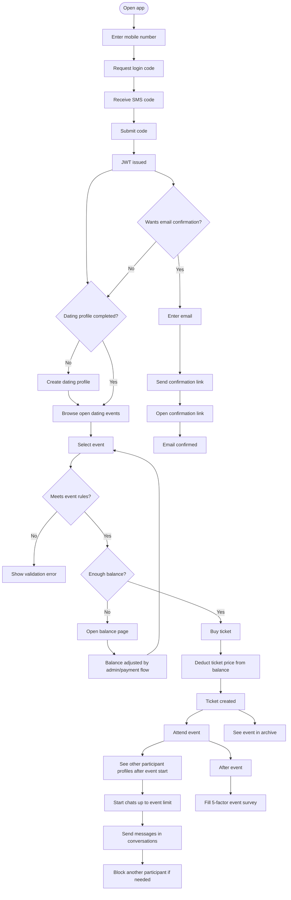

# EndUser Flow

## Main Permissions

- Can login with mobile number and SMS code.
- Can complete and update dating profile.
- Can view own balance.
- Can buy tickets for open events when profile, age, gender capacity, and balance rules pass.
- Cannot create, open, close, cancel, or manage dating events.
