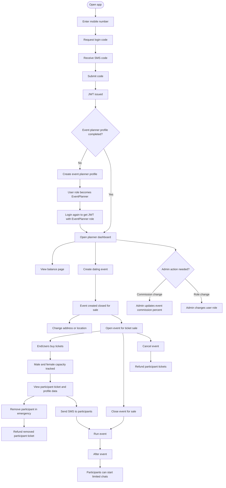

# EventPlanner Flow

## Main Permissions

- Can login with mobile number and SMS code.
- Can create and update EventPlanner profile.
- Can create dating events after planner profile exists.
- Can open, close, cancel, and change location for owned events.
- Can send SMS messages to participants of owned events.
- Can view own balance.
- Cannot change event commission percent unless Admin.
- Cannot manage other planners' events unless Admin.
