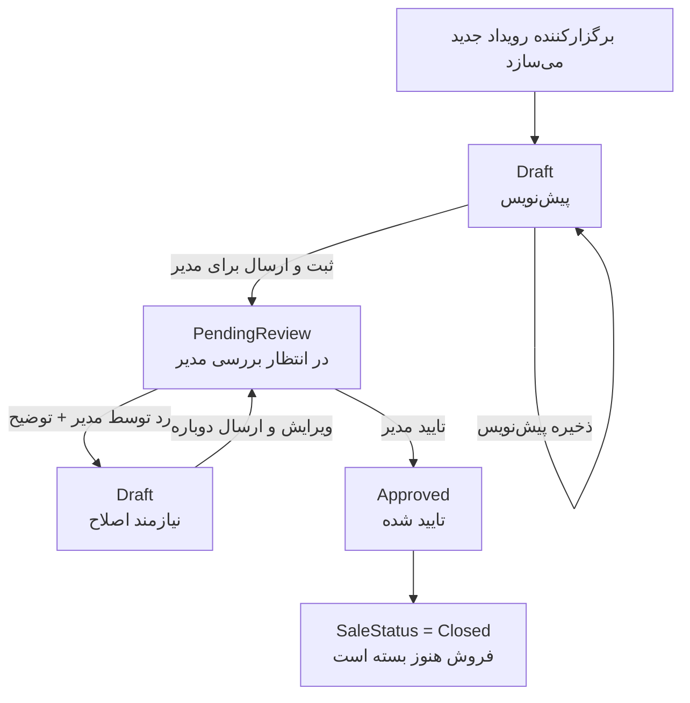

# 01 - ثبت و بررسی رویداد

رویداد اول همیشه پیش‌نویس است. ذخیره معمولی فقط پیش‌نویس را نگه می‌دارد؛ ارسال برای مدیر رویداد را وارد صف بررسی می‌کند.

وضعیت‌های درگیر: `EventApprovalStatus`, `EventSaleStatus`

لاگ‌ها: `EventDraftSaved`, `EventSubmittedForReview`, `EventApproved`, `EventReturnedToDraft`
