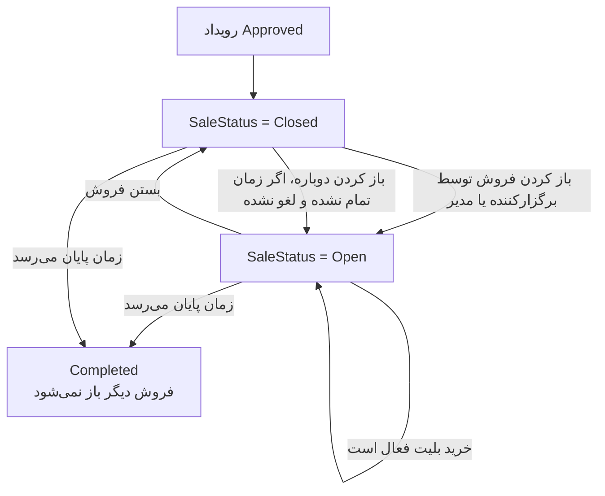

# 02 - فروش رویداد

بعد از تایید مدیر، فروش می‌تواند توسط مدیر یا برگزارکننده باز و بسته شود. بستن فروش به معنی لغو رویداد نیست.

وضعیت‌های درگیر: `EventApprovalStatus.Approved`, `EventSaleStatus`, `EventLifecycleStatus`

لاگ‌ها: `EventSaleOpened`, `EventSaleClosed`, `EventCompleted`
