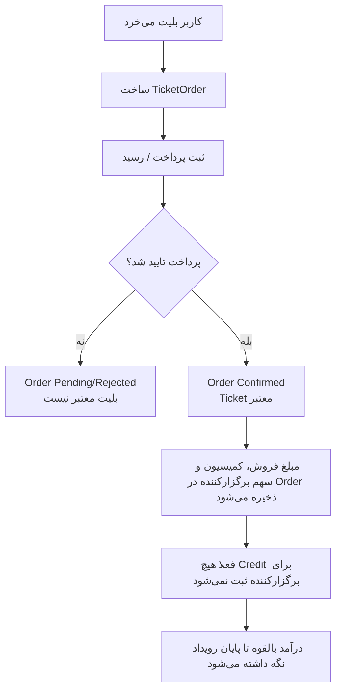

# 03 - خرید بلیت و مالی

خرید بلیت نباید همان لحظه برگزارکننده را بستانکار کند. درآمد برگزارکننده تا پایان رویداد فقط قابل محاسبه است.

وضعیت‌های درگیر: `TicketOrderStatus`, `TicketOrderPaymentStatus`

لاگ‌ها: `DatingEventTicketPurchased`
