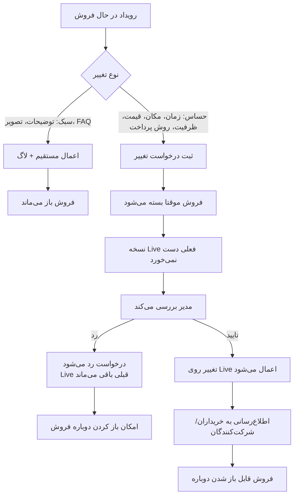

# 04 - تغییرات رویداد

تغییرات سبک مستقیم ذخیره می‌شوند. تغییرات حساس، مخصوصاً بعد از فروش بلیت، باید درخواست تغییر بسازند و پس از تایید مدیر اعمال شوند.

وضعیت‌های درگیر: `EventChangeRequestStatus`, `EventSaleStatus`

لاگ‌ها: `EventChangeRequested`, `EventChangeApproved`, `EventChangeRejected`
