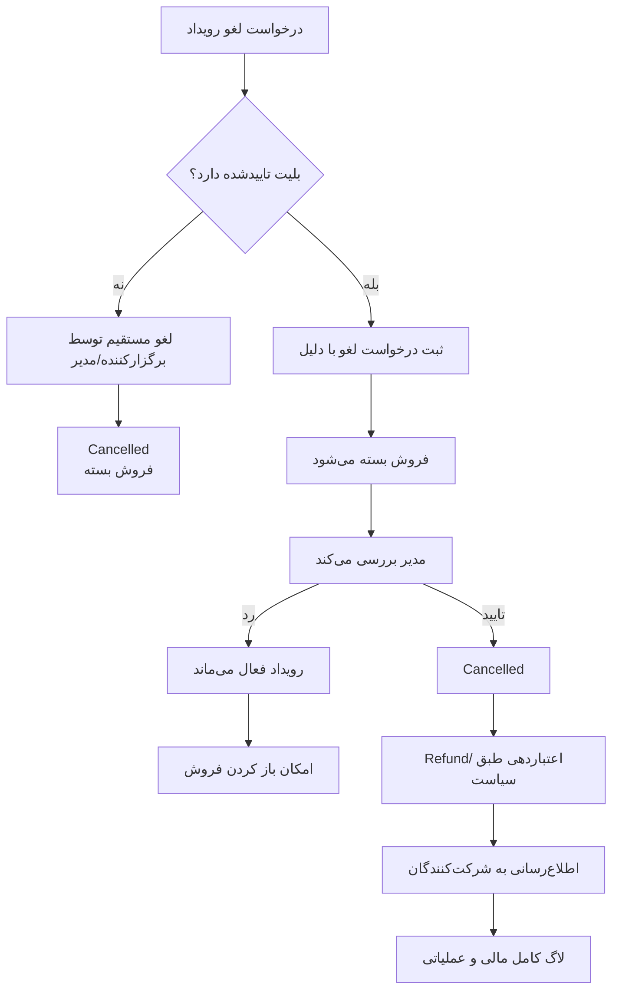

# 05 - لغو رویداد

لغو رویداد با بستن فروش فرق دارد. اگر بلیت تاییدشده وجود داشته باشد، برگزارکننده درخواست لغو ثبت می‌کند و مدیر تصمیم می‌گیرد.

وضعیت‌های درگیر: `EventCancellationRequestStatus`, `EventLifecycleStatus.Cancelled`, `EventSaleStatus.Closed`

لاگ‌ها: `EventCancellationRequested`, `EventCancelled`
