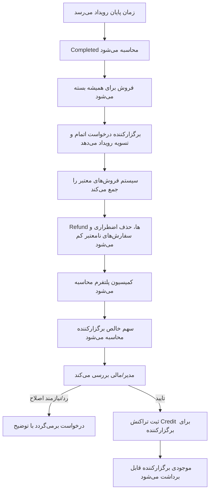

# 06 - اتمام و تسویه رویداد

بعد از پایان رویداد، برگزارکننده درخواست اتمام و تسویه ثبت می‌کند. فقط پس از تایید مالی، تراکنش بستانکاری برای برگزارکننده ثبت می‌شود.

وضعیت‌های درگیر: `EventSettlementRequestStatus`, `BalanceTransactionType.EventSettlementCredit`

لاگ‌ها: `EventSettlementRequested`, `EventSettlementApproved`, `EventOrganizerCredited`
