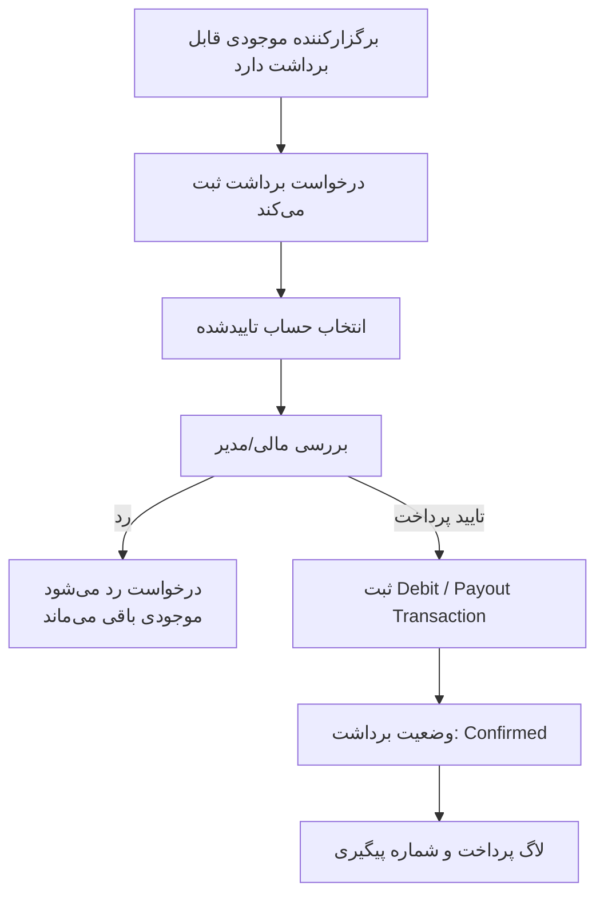

# 07 - برداشت موجودی برگزارکننده

برداشت بعد از بستانکار شدن حساب برگزارکننده انجام می‌شود و مستقل از تسویه هر رویداد است.

وضعیت‌های درگیر: `PlannerWithdrawalRequestStatus`, `BalanceTransactionType.PlannerWithdrawalPayout`

لاگ‌ها: `WithdrawalRequested`, `WithdrawalConfirmed`, `WithdrawalRejected`
