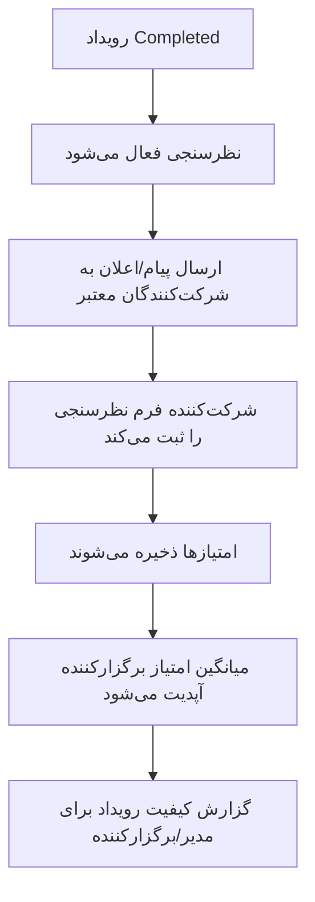

# 08 - نظرسنجی رویداد

نظرسنجی فقط بعد از پایان رویداد و فقط برای شرکت‌کننده دارای بلیت معتبر فعال می‌شود.

وضعیت‌های درگیر: `EventLifecycleStatus.Completed`, `EventSurveyResponse`

لاگ‌ها: `EventSurveySubmitted`
