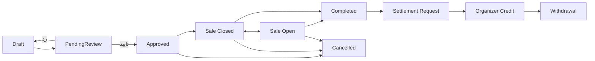

# 09 - نمای کلی چرخه رویداد

این نمودار نمای فشرده کل چرخه رویداد، فروش، اتمام، تسویه و برداشت است.

وضعیت‌های درگیر: `EventApprovalStatus`, `EventSaleStatus`, `EventLifecycleStatus`

لاگ‌ها: همه اکشن‌های `EventWorkflowActionType`
