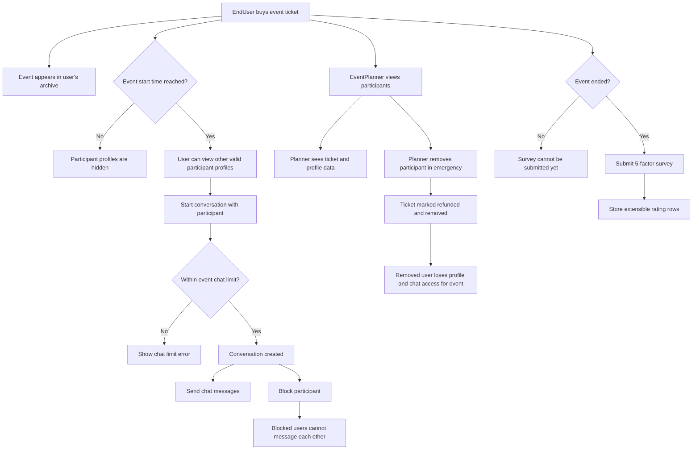

# Post-Ticket Participant, Chat, and Survey Flow

## Implemented Rules

- EndUsers can view their event archive after buying tickets.
- EndUsers can see other participant profiles only after the event start time.
- Removed or refunded tickets cannot access participant profiles, event chat, or survey submission.
- Chat conversations are event-scoped.
- Chat connections are limited by `DatingEvent.NumberOfChatAllowed`.
- Users can block each other inside a conversation.
- Blocked users cannot continue sending messages to each other.
- Surveys are available after event end time.
- Surveys require all 5 current rating factors:
  - Overall experience
  - Event organization
  - Venue and location
  - Participant quality
  - Safety and comfort
- EventPlanners can view participants for their own events.
- EventPlanners can remove a participant in an emergency, refund the ticket, and record the reason.
- Admins can manage all events and participants.
