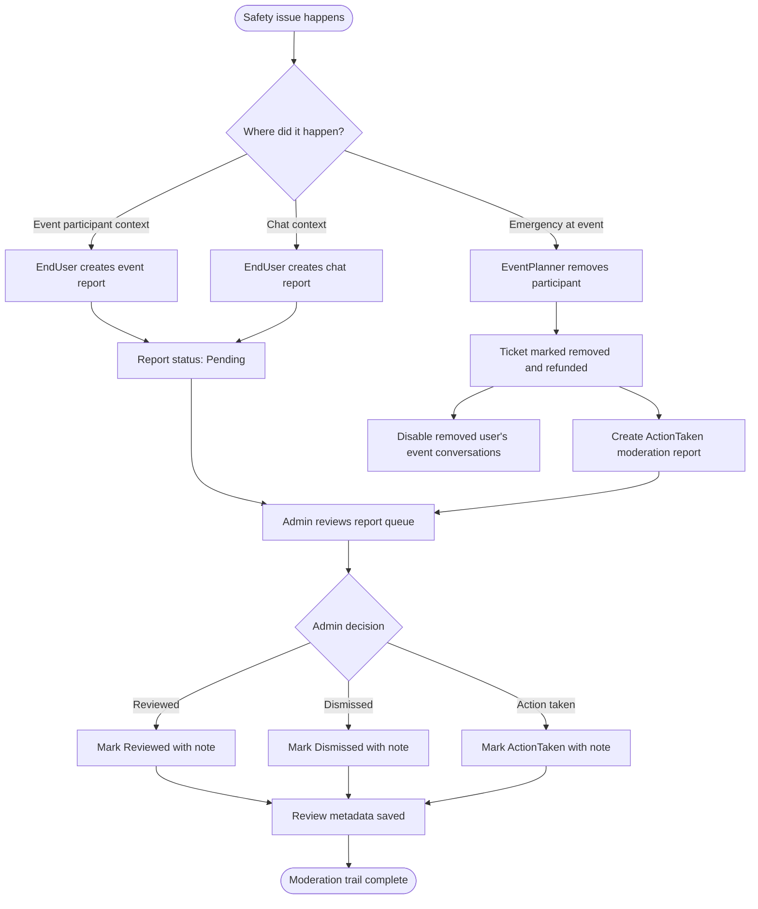

# Safety and Moderation Flow

## Privacy Rules

- EndUser public profile and chat responses do not expose `MobileNumber` or `Email`.
- EventPlanner participant-management responses can expose participant `MobileNumber` for emergency calls.
- Admin moderation and management responses can expose operational data when needed.
- `Email` stays hidden from participant/profile responses by default.

## Implemented Moderation Rules

- Users cannot report themselves.
- Event reports require both users to belong to the event.
- Chat reports require the reporter to belong to the conversation.
- Admins can list pending/reviewed/dismissed/action-taken reports.
- Admin review stores status, note, reviewer id, and review time.
- Emergency removal records refund/removal reason and creates an action-taken moderation report.
