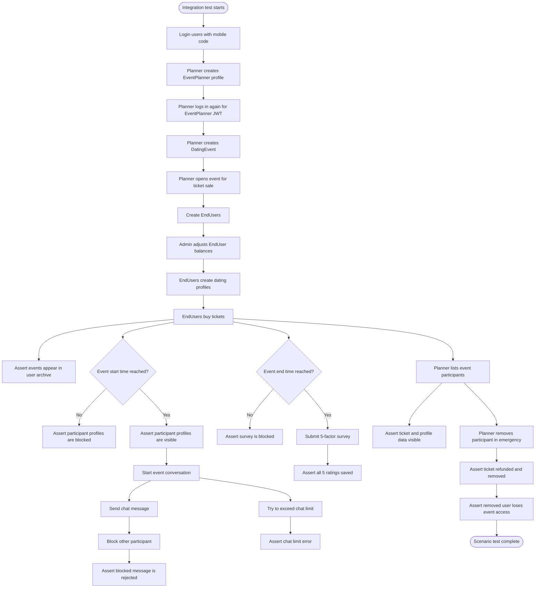

# Scenario-Based Test Diagram

## Main Test Scenarios

- Passwordless mobile login creates a valid JWT.
- EventPlanner profile upgrades the user role.
- EndUsers need profile and balance before buying tickets.
- Participant profile visibility starts only after event start time.
- Chat is limited by event settings.
- Blocked chat users cannot message each other.
- Surveys require all 5 factors and only work after event end time.
- Emergency participant removal refunds the ticket and removes access.
