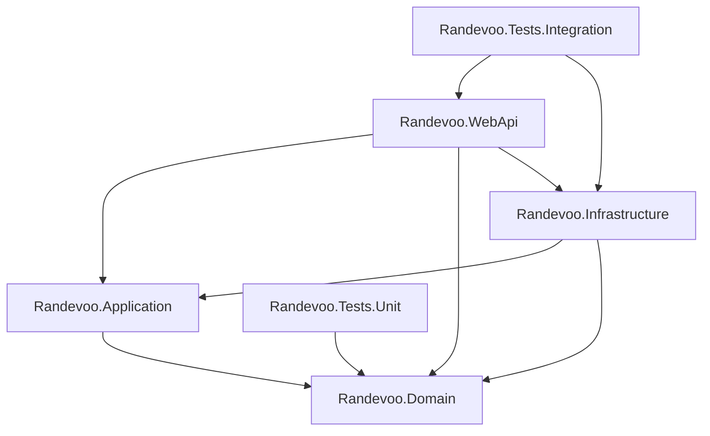

# System Overview

## Project Purpose

Randevoo is an event-first dating platform. The current implementation supports passwordless mobile login, dating profiles, event planner profiles, dating events, tickets, balances, participant visibility after event start, event-scoped chat, surveys for planner quality, moderation reports, and admin controls.

## Architecture Style

The solution follows a layered Clean Architecture / CQRS style:

- `Randevoo.Domain`: entities, value objects, enums, domain events, repository interfaces, domain exceptions.
- `Randevoo.Application`: MediatR commands/queries, DTOs, orchestration, notification/auth abstractions.
- `Randevoo.Infrastructure`: EF Core DbContext, SQL Server persistence, repositories, unit of work, JWT and console notification implementations.
- `Randevoo.WebApi`: ASP.NET Core minimal API endpoints, JWT authentication, authorization policies, OpenAPI/Scalar.
- `Randevoo.Tests.Unit`: domain-level unit tests.
- `Randevoo.Tests.Integration`: WebApplicationFactory integration tests with EF Core InMemory.

## Technology Stack

| Area | Implementation |
|---|---|
| Runtime | .NET 10 |
| API | ASP.NET Core Minimal APIs |
| CQRS | MediatR 14.1.0 |
| Persistence | EF Core 10.0.8 |
| Database | SQL Server |
| Auth | JWT Bearer, passwordless mobile code |
| API Docs | Microsoft.AspNetCore.OpenApi, Scalar.AspNetCore |
| Tests | xUnit, FluentAssertions, WebApplicationFactory, EF InMemory |
| Notifications | Console SMS/email senders |

## Major Modules

- Authentication and email confirmation
- Dating profile management
- Event planner profile management
- Dating event management
- Ticket purchase and participant archive
- Event participant visibility and emergency removal
- Event chat and blocking
- Event survey and planner quality metrics
- Balance and transaction history
- Event type lookup and admin management
- Moderation reports and admin review
- Admin user-role and balance management

## Dependency Graph

## External Integrations

- SQL Server via EF Core.
- Console SMS sender through `ISmsSender`.
- Console email sender through `IEmailSender`.
- JWT token creation through `IJwtTokenService`.

## Not Detected

- No SignalR hubs found.
- No background jobs found.
- No scheduled tasks found.
- No external third-party HTTP APIs found.
- No message broker integration found.

## TODO / Assumption Required

- `DatingEvent.EventType` is still a string even though `EventType` lookup exists. Assumption required: whether future events should reference `EventType.Id`.
- Notification senders are console implementations. TODO: replace with production SMS/email providers.
- Domain events are collected on entities but no dispatcher was found.
