# Use Case Diagram

```mermaid
flowchart LR
    EndUser[EndUser]
    EventPlanner[EventPlanner]
    Admin[Admin]

    subgraph Auth[Authentication]
        Login((Login with mobile code))
        ConfirmEmail((Confirm email))
    end

    subgraph Profile[Profiles]
        ManageDatingProfile((Manage dating profile))
        ManagePlannerProfile((Manage planner profile))
        ViewParticipantProfiles((View event participant profiles))
    end

    subgraph Events[Dating Events]
        BrowseEvents((Browse open events))
        BuyTicket((Buy ticket))
        ViewArchive((View event archive))
        CreateEvent((Create dating event))
        OpenCloseEvent((Open or close event sale))
        CancelEvent((Cancel event and refund))
        ChangeLocation((Change event location))
        SendSms((Send SMS to participants))
        ViewParticipants((View event participants))
        RemoveParticipant((Emergency remove participant))
        ChangeCommission((Change commission percent))
        ManageEventTypes((Manage event types))
    end

    subgraph Money[Balance]
        ViewBalance((View own balance))
        AdjustBalance((Adjust user balance))
    end

    subgraph Chat[Event Chat]
        StartConversation((Start conversation))
        SendMessage((Send message))
        BlockUser((Block user))
        ReportUser((Report user))
    end

    subgraph Survey[Survey]
        SubmitSurvey((Submit 5-factor survey))
        ViewSurvey((View own survey))
    end

    subgraph AdminOps[Admin Operations]
        ChangeRole((Change user role))
        ManageAll((Manage all users and events))
        ReviewReports((Review moderation reports))
    end

    EndUser --> Login
    EndUser --> ConfirmEmail
    EndUser --> ManageDatingProfile
    EndUser --> BrowseEvents
    EndUser --> BuyTicket
    EndUser --> ViewArchive
    EndUser --> ViewBalance
    EndUser --> ViewParticipantProfiles
    EndUser --> StartConversation
    EndUser --> SendMessage
    EndUser --> BlockUser
    EndUser --> ReportUser
    EndUser --> SubmitSurvey
    EndUser --> ViewSurvey

    EventPlanner --> Login
    EventPlanner --> ConfirmEmail
    EventPlanner --> ManagePlannerProfile
    EventPlanner --> CreateEvent
    EventPlanner --> OpenCloseEvent
    EventPlanner --> CancelEvent
    EventPlanner --> ChangeLocation
    EventPlanner --> SendSms
    EventPlanner --> ViewParticipants
    EventPlanner --> RemoveParticipant
    EventPlanner --> ViewBalance

    Admin --> Login
    Admin --> AdjustBalance
    Admin --> ChangeRole
    Admin --> ChangeCommission
    Admin --> ManageEventTypes
    Admin --> ReviewReports
    Admin --> ManageAll
    Admin --> CreateEvent
    Admin --> OpenCloseEvent
    Admin --> CancelEvent
    Admin --> ChangeLocation
    Admin --> ViewParticipants
    Admin --> RemoveParticipant
```

## Actors

- `EndUser`: buys tickets, views participant profiles, chats, blocks users, submits surveys.
- `EventPlanner`: owns events and manages participants for their events.
- `Admin`: controls roles, balances, commissions, users, and all events.
